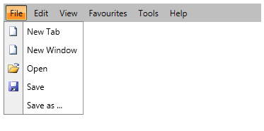

# Using Static Items

This tutorial will walk you through the common task of populating __RadMenu__ with __RadMenuItems__ declaratively. 

__Example 1__ shows a regular __RadMenu__ declaration without items.

__Example 1: RadMenu declaration__

<snippet id='radmenu-populating-with-data-using-static-items-block_1-xaml' />

In order to add items you need to use the __RadMenu's Items__ property. The __Items__ property is an __ItemCollection__ which contains your __RadMenuItems__. For example, the following lines will add the top-level items of the menu.

__Example 2: RadMenu with static top-level items__

<snippet id='radmenu-populating-with-data-using-static-items-block_2-xaml' />

#### __Figure 1: RadMenu with static top-level items__

Each of the __RadMenuItems__ can have child items that are defined in the same way. __Example 3__ illustrates how to add submenu items to one of the top-level items.

__Example 3: Adding static submenu items__

<snippet id='radmenu-populating-with-data-using-static-items-block_3-xaml' />

#### __Figure 2: RadMenu with static submenu items__

The submenu items can also have children on their own.

## See Also

 * [Populating with Data - Overview]()

 * [Data Binding Support Overview]()

 * [Binding to Dynamic Data]()