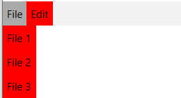

# Styling the RadMenuItem

In order to style RadMenuItem elements, you can set the __ItemContainerStyle__ property of the RadMenu or a create an implicit style targeting __RadMenuItem__.

> When using __ItemContainerStyle__ with static items, it will be applied only to the direct children of the __RadMenu__ - the top-level items. If you want their child items to have the same style you have to manually set the __ItemContainerStyle__ property of their parents.

<!-- -->

> When using __ItemContainerStyle__ with dynamic items, its value gets inherited through the hierarchy thanks to the __HierarchicalDataTemplate__. You are free to break the inheritance, when needed, by using multiple nested __HierarchicalDataTemplates__ and by setting the __ItemContainerStyle__ property of each of them. To learn more about using __RadMenu__ with dynamic data read [here]().

<!-- -->

> Choosing the style for an item depending on its position in the hierarchy can be done by using the __ItemContainerStyleSelector__ property. Read more about selectors [here]().  

## Targeting the RadMenuItem Element

In order to style all __RadMenuItem__ elements in the application, you can create an implicit style targeting __RadMenuItem__ as demonstrated in the __Example 1__.

#### __[XAML] Example 1: Styling RadMenuItem__

{{region xaml-radmenu-styling-and-appearance-styling-radmenuitem_0}}
	<Grid>
        <Grid.Resources>
             <!-- If you are using the NoXaml binaries, you will have to base the style on the default one for the theme like so: 
		    
        </Grid.Resources>
        <telerik:RadMenu VerticalAlignment="Top" >
            <telerik:RadMenuItem Header="File">
                <telerik:RadMenuItem Header="File 1" />
                <telerik:RadMenuItem Header="File 2" />
                <telerik:RadMenuItem Header="File 3" />
            </telerik:RadMenuItem>
            <telerik:RadMenuItem Header="Edit" />
        </telerik:RadMenu>
    </Grid>
{{endregion}}

#### __Figure 1: RadMenuItems with red Background in the Fluent theme__

>tip In __Figure 1__ you can observe that the clicked menu item has a different background. Inside the ControlTemplate of the RadMenuItem there are triggers/visual states, which set the Background when an item is clicked and that value takes precedence over the value from the implicit style. In order to change this behavior, you can [extract and modify the ControlTemplate]() of the RadMenuItem for the theme(s) that you are using.

## See Also

 * [Styles and Templates - Overview]()

 * [Visual States]()

 * [Styling the RadMenu]()

 * [Template and Style Selectors]()
