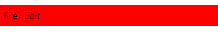

# Styling the RadMenu

In order to style a RadMenu element, you can set the __Style__ property of the control or create an implicit style targeting RadMenu. 

## Targeting the RadMenu Element

In order to style all __RadMenu__ elements in the application, you can create an implicit style targeting __RadMenu__ as demonstrated in the __Example 1__.

#### __[XAML] Example 1: Styling RadMenu__

{{region xaml-radmenu-styling-and-templates-styling-radmenu-0}}
	<Grid>
        <Grid.Resources>
            <!-- If you are using the NoXaml binaries, you will have to base the style on the default one for the theme like so: 
            
        </Grid.Resources>
        <telerik:RadMenu VerticalAlignment="Top" >
            <telerik:RadMenuItem Header="File" />
            <telerik:RadMenuItem Header="Edit" />
        </telerik:RadMenu>
    </Grid>
{{endregion}}

#### __Figure 1: RadMenu with red Background in the Fluent theme__

>tip In order to learn how to further modify the control by extracting its ControlTemplate, read the [Editing Control Templates]() article.

## See Also

 * [Styles and Templates - Overview]()

 * [Visual States]()

 * [Styling the RadMenuItem]()

 * [Template and Style Selectors]()