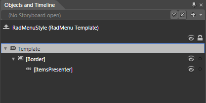
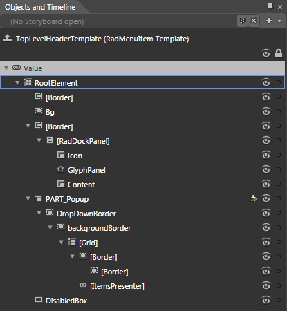
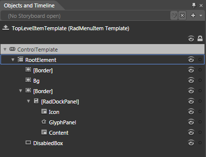
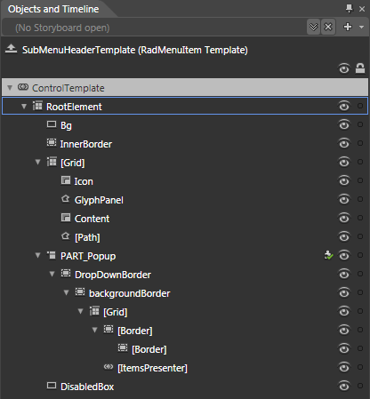
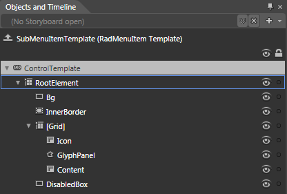
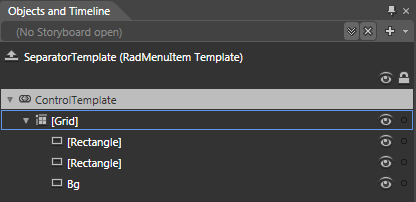

# Templates Structure

Like most SilverlightWPF controls, the __RadMenu__also allows you to template it in order to change the control from the inside. Except for templating the whole control, you can template parts of it or even independent controls related to it. This topic will make you familiar with the:
      

* [RadMenu Template Structure](#RadMenu_Template_Structure)

* [RadMenuItem Template Structures](#RadMenuItem_Template_Structures)

>tip
        For more information about templating and how to modify the default templates of the __RadControls__read [the common topics](http://www.telerik.com/help/silverlight/common-styling-appearance-edit-control-templates-blend.html) on this matter.
      

## RadMenu Template Structure

This section will explain the structure of the __RadMenu__'s template. Here is a snapshot of the template generated in Expression Blend.
        

It contains the following parts:

* __[Border]__ - the layout root for the template and is of type __Border__. Visualizes the background and the border of the __RadMenu__.
          

* __[ItemsPresenter]__ - represents the host control for the __RadMenu__'s items and is of type __ItemsPresenter__.
          

## RadMenuItem Template Structures

The __RadMenuItem__ uses several templates depending on its place in the hierarchy. Before explaining the template structures, you must understand the different types of menu items depending on the hierarchy.
        

* __Top-Level Header Items__ - items that __are__ placed in the__top level__ of the hierarchy and __have__ child items.
          

* __Top-Level Items__ - items that __are__ placed in the__top level__ of the hierarchy and __don't____have__ child items.
          

* __Submenu Header Items__ - items that __are not__in the __top____level__ of the hierarchy and __have__ child items.
          

* __Submenu Items__ - items that __are not__in the __top____level__ of the hierarchy and __don't____have__ child items.
          

* __Separator Items__ - items that are marked as [separators]().
          

Depending on this type, the appropriate template is selected. The __RadMenuItem__ exposes several properties of type __ControlTemplate__, that are used to set the different templates:
        

* __TopLevelHeaderTemplateKey__ - represents the template, applied when the item is a __Top-Level Header Item__.
          

* __TopLevelItemTemplateKey__ - represents the template, applied when the item is a __Top-Level Item__.
          

* __SubmenuHeaderTemplateKey__ - represents the template, applied when the item is __Submenu Header Item__.
          

* __SubmenuItemTemplateKey__ - represents the template, applied when the item is __Submenu Item__.
          

* __SeparatorTemplateKey__ - represents the template, applied when the item is __Separator Item__.
          

>The __Template__ property has the same effect as the __SubmenuItemTemplateKey__ property.
          

For details about the template parts of the different templates read the following sections:

* [Top-Level Header Template](#Top-Level_Header_Template)

* [Top-Level Item Template](#Top-Level_Item_Template)

* [Submenu Header Template](#Submenu_Header_Template)

* [Submenu Item Template](#Submenu_Item_Template)

* [Separator Template](#Separator_Template)

## Top-Level Header Template

This section will explain the structure of the __RadMenuItem__'s____Top-Level Header template. Here is a snapshot of the template generated in Expression Blend.
        

It contains the following parts:

* __RootElement__ - represents the layout root of the template and is of type __Grid__.
            

* __[Border]__ - represents the border around the item's header and is of type __Border__.
              

* __Bg__ - represents the background of the item's header and is of type __Border__.
              

* __[Border]__ - hosts the item's header and is of type __Border__.
                

* __[RadDockPanel]__ - defines the layout of the header's content and is of type __RadDockPanel__.
                    

* __Icon__ - represents the icon of the item and is of type __ContentPresenter__.
                      

* __GlyphPanel__ - represents the checked mark of the item and is of type __Path__.
                      

* __Content__ - displays the content of the item's header and is of type __ContentPresenter__.
                      

* __PART_Popup__ - hosts the submenu items and is of type __Popup__.
                

* __DropDownBorder__ - wraps the content of the Popup and is of type __Border__.
                    

* __backgroundBorder__ - used to define the background and the __borders__ of the Popup and is of type __Border__.
                        

* __[Grid]__

* __[Border]__- used to define the background and the borders of the __Popup__ and is of type __Border__.
                                

* __[Border]__ - used to define the background and the borders of the __Popup__ and is of type __Border__.
                                  

* __[ItemsPresenter]__ -  represents the host control for the submenu items and is of type __ItemsPresenter__.
                              

* __DisabledBox__ - appears when the item is disabled and is of type __Rectangle__.
              

## Top-Level Item Template

This section will explain the structure of the __RadMenuItem__'s Top-Level Item template. Here is a snapshot of the template generated in Expression Blend.
        

It contains the following parts:

* __RootElement__ - represents the layout root of the template and is of type __Grid__.
            

* __[Border]__ - represents the border around the item and is of type __Border__.
              

* __Bg__ - represents the background of the item and is of type __Border__.
              

* __[Border]__ - hosts the item's header and is of type __Border__.
                

* __[RadDockPanel]__ - defines the layout of the item's content and is of type __RadDockPanel__.
                    

* __Icon__ - represents the icon of the item and is of type __ContentPresenter__.
                      

* __GlyphPanel__ - represents the checked mark of the item and is of type __Path__.
                      

* __Content__ - displays the content of the item and is of type __ContentPresenter__.
                      

* __DisabledBox__ - appears when the item is disabled and is of type __Rectangle__.
              

## Submenu Header Template

This section will explain the structure of the __RadMenuItem's__Submenu Header template. Here is a snapshot of the template generated in Expression Blend.
        

It contains the following parts:

* __RootElement__ - represents the layout root of the template and is of type __Grid__.
            

* __Bg__ - represents the background of the item's header and is of type __Rectangle__.
              

* __[InnerBorder]__ - hosts the item's header and is of type __Border__.
                

* __[RadDockPanel]__ - defines the layout of the header's content and is of type __RadDockPanel__.
                    

* __Icon__ - represents the icon of the item and is of type __ContentPresenter__.
                      

* __GlyphPanel__ - represents the checked mark of the item and is of type __Path__.
                      

* __Content__ - displays the content of the item's header and is of type __ContentPresenter__.
                      

* __[Path]__ - represents the expand arrow and is of type __Path__.
                      

* __PART_Popup__ - hosts the submenu items and is of type __Popup__.
                

* __DropDownBorder__ - wraps the content of the Popup and is of type __Border__.
                    

* __backgroundBorder__ - used to define the background and the __borders__ of the Popup and is of type __Border__.
                        

* __[Grid]__

* __[Border]__- used to define the background and the borders of the __Popup__ and is of type __Border__.
                                

* __[Border]__ - used to define the background and the borders of the __Popup__ and is of type __Border__.
                                  

* __[ItemsPresenter]__ -  represents the host control for the submenu items and is of type __ItemsPresenter__.
                              

* __DisabledBox__ - appears when the item is disabled and is of type __Rectangle__.
              

## Submenu Item Template

This section will explain the structure of the __RadMenuItem's__Submenu Item template. Here is a snapshot of the template generated in Expression Blend.
        

It contains the following parts:

* __RootElement__ - represents the layout root of the template and is of type __Grid__.
            

* __Bg__ - represents the background of the item's header and is of type __Rectangle__.
              

* __[InnerBorder]__ - hosts the item's header and is of type __Border__.
                

* __[RadDockPanel]__ - defines the layout of the header's content and is of type __RadDockPanel__.
                    

* __Icon__ - represents the icon of the item and is of type __ContentPresenter__.
                      

* __GlyphPanel__ - represents the checked mark of the item and is of type __Path__.
                      

* __Content__ - displays the content of the item's header and is of type __ContentPresenter__.
                      

* __[Path]__ - represents the expand arrow and is of type __Path__.
                      

* __DisabledBox__ - appears when the item is disabled and is of type __Rectangle__.
              

## Separator Template

This section will explain the structure of the __RadMenuItem's__Separator template. Here is a snapshot of the template generated in Expression Blend.
        

It contains the following parts:

* __[Grid]__ - represents the layout root of the template and is of type __Grid__.
            

* __[Rectangle]__ - represents the top part of the separator and is of type __Rectangle__.
              

* __[Rectangle]__ - represents the bottom part of the separator and is of type __Rectangle__.
              

* __Bg__ - represents the element that binds to the control's properties and is of type __Rectangle__.
              

# See Also

 * [Styles and Templates - Overview]()

 * [Visual States]()

 * [Styling the RadMenu]()

 * [Styling the RadMenuItem]()

 * [Template and Style Selectors]()
