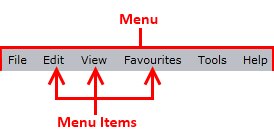
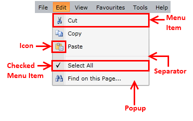

# Visual Structure

This section defines terms and concepts used in the scope of __RadMenu__ that you need to get familiar with prior to continue reading this help. They can also be helpful when contacting our support service in order to describe your issue better. Below you can see snapshots and explanations of the main states and visual elements of the standard __RadMenu__ control.        

The __RadMenu__ is a user interface control that presents users with navigation in the form of menu. The contents can be shown and hidden as the menu items expand and collapse. In its default state, the items are collapsed, displaying only their headers as it is shown on the snapshot below.        

When a menu item is selected it gets expanded and its sub items appear. See the following snapshots for more detailed information.

* __Menu -__ the container that holds the top-level menu items.          

* __Menu Item__ - a __RadMenuItem__, that provides a way to display data in a hierarchical structure. Each __RadMenuItem__ can have other __RadMenuItems__ as children.

* __Checkable Item__ - a __RadMenuItem__ that can have two states - checked and unchecked (similar to the __CheckBox__ control).

* __Separator__ - a __RadMenuItem__ that is defined as a separator between the different groups of items.

* __Icon__ - part of the __RadMenuItem__ that allows you to display a picture.

* __Popup__ __Area__ - the part of the __RadMenuItem__ that contains the child __RadMenuItems__. It appears only when the parent __RadMenuItem__ is selected.

>tipFor more detailed descriptions of the required parts of the control please take a look at the [Templates Structure]() topic.

## See Also

 * [Overview]()

 * [Getting Started]()