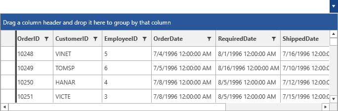

# DropDown Properties

This article describes the set of properties that can be used for manipulating the DropDown of __RadMultiColumnComobBox__.

* [Height of the DropDown](#height-of-the-dropdown)
* [Width of the DropDown](#width-of-the-dropdown)
* [Set Min and Max Height or Width of the DropDown](#set-min-and-max-height-or-width-of-the-dropdown)
* [Disable DropDown Resizing](#disable-dropdown-resizing)
* [Keep the DropDown Open](#keep-the-dropdown-open)
* [Open the DropDown on Input](#open-the-dropdown-on-input)
* [Position of the DropDown](#position-of-the-dropdown)
* [Closing the DropDown when Selecting](#closing-the-dropdown-when-selecting)

## Height of the DropDown

The Height of the DropDown element can be set through the __DropDownHeight__ property.

__Example 1: Setting the DropDownHeight property__
```XAML
	 <telerik:RadMultiColumnComboBox DisplayMemberPath="Name" DropDownHeight="200">
            <telerik:RadMultiColumnComboBox.ItemsSourceProvider>
                <telerik:GridViewItemsSourceProvider ItemsSource="{Binding Orders}" />
            </telerik:RadMultiColumnComboBox.ItemsSourceProvider>
        </telerik:RadMultiColumnComboBox>
```

#### __Figure 1: Setting the DropDownHeight property__


## Width of the DropDown

The Width of the DropDown element can be set through the __DropDownWidth__ property.

## Set Min and Max Height or Width of the DropDown

The minimum and maximum Width or Height space that the DropDown can take can be controlled by the following set of properties.

* __DropDownMaxHeight__  
* __DropDownMaxWidth__
* __DropDownMinHeight__
* __DropDownMaxHeight__

## Disable DropDown Resizing

By default, the user is able to resize the DropDown of the control. This can be altered by setting the boolean __CanUserResizeDropDown__ property of the control to __False__.

## Keep the DropDown Open

When the DropDown of __RadMultiColumnComboBox__ is opened, it will be closed on losing focus. In order to keep it open the __KeepDropDownOpen__ property can be set to __True__.

## Open the DropDown on Input

When receiving an input in the AutoCompleteBox the control will automatically open its DropDown. To disable this, the __OpenDropDownOnInput__ property can be set to __False__.

## Position of the DropDown

__RadMultiColumnComboBox__ provides a predefined set of options for setting the position of the DropDown. They are exposed through the __DropDownPlacement__ property. It is a [PlacementMode enumaration](https://docs.microsoft.com/en-us/dotnet/api/system.windows.controls.primitives.placementmode?view=netframework-4.7.2) and has the following values.

* __Absolute__
* __AbsolutePoint__
* __Bottom__
* __Center__
* __Left__
* __Mouse__
* __MousePoint__
* __Relative__
* __RelativePoint__
* __Right__
* __Top__

## Closing the DropDown when Selecting

> The __CloseDropDownAfterSelectionInput__ property is respected only in __Single SelectionMode__

By default, the __DropDown__ of RadMultiColumnComboBox will be kept open when the user performs selection. The __CloseDropDownAfterSelectionInput__ property of RadMultiColumnComboBox can be used in order to close the __DropDown__ each time the user applies a new selection. This can be achieved by setting its value to __True__.

__Example 2: Setting the CloseDropDownAfterSelectionInput property__
```XAML
	<telerik:RadMultiColumnComboBox CloseDropDownAfterSelectionInput="True"
                                        DisplayMemberPath="Name" SelectionMode="Multiple">
            <telerik:RadMultiColumnComboBox.ItemsSourceProvider>
                <telerik:GridViewItemsSourceProvider ItemsSource="{Binding Clubs}" />
            </telerik:RadMultiColumnComboBox.ItemsSourceProvider>
        </telerik:RadMultiColumnComboBox>
```

## See Also

* [Getting Started]()
* [AutoComplete]()

