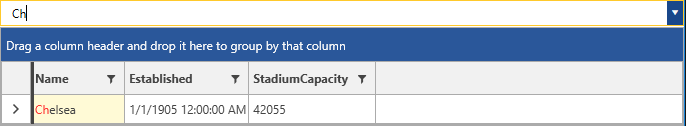
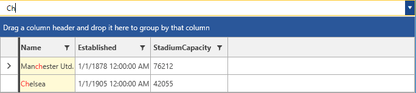

# AutoComplete

__RadMultiColumnComboBox__ provides a built-in set of auto-completion options. The control exposes the __AutoCompleteMode__ property for setting them. It is an enumeration that has the __Suggest, Append, SuggestAppend and Search__ values. This topic will go through each one of them.

>The case sensitivity of the user's input can be controlled through the __MatchCase__ boolean property. Its default value is __False__ meaning that the input will be case insensitive. Respectively, when set to __True__ it will be case sensitive.

>important The __Append, Suggest and SuggestAppend__ modes by default use a __StartsWith__ operator for a string data type.

## Suggest

The Suggest mode filters the data but does not append text in the input field.

__Example 1: Setting the AutoCompleteMode to Suggest__
```XAML
	<telerik:RadMultiColumnComboBox VerticalAlignment="Top" AutoCompleteMode="Suggest" MatchCase="True">
            <telerik:RadMultiColumnComboBox.ItemsSourceProvider>
                <telerik:GridViewItemsSourceProvider ItemsSource="{Binding Clubs, Source={StaticResource MyViewModel}}"/>
            </telerik:RadMultiColumnComboBox.ItemsSourceProvider>
        </telerik:RadMultiColumnComboBox>
```

#### __Figure 1: Setting the AutoCompleteMode to Suggest__


## Append

The Append mode only suggests items without filtering the RadGridView. The first found item would be set as the __CurrentItem__ of the RadGridView. 

#### __Figure 2: Setting the AutoCompleteMode to Append__


## SuggestAppend

When using the SuggestAppend mode, both filtering and auto-completion is applied. This is the __default value__ of the AutoCompleteMode property.

#### __Figure 3: Setting the AutoCompleteMode to SuggestAppend__


## Search

The Search mode filters and highlights the data. For a __string__ property the __Contains__ operator will be applied, whereas for any other type the __IsEqualTo__ will be used. This is basically the [search as you type]() mechanism of RadGridView.

#### __Figure 4: Setting the AutoCompleteMode to Search__


## See Also

* [Getting Started]()
* [DropDown Properties]()
