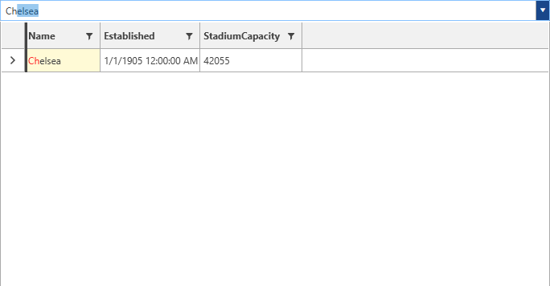
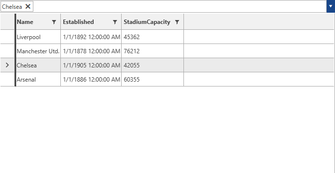
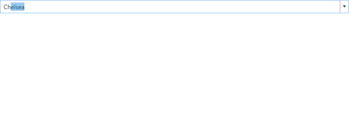

# Keyboard and Mouse Navigation

* [Keyboard Navigation](#keyboard-navigation)
* [Mouse Navigation](#mouse-navigation)

## Keyboard Navigation

The control has a built-in functionality attached to the following keys. In order to demonstrate them, the following user's input will be used.

__Figure 1: Entering input in the AutoCompleteBox__

* __Tab__ and __Enter__: When the user's input in the AutoCompleteBox matches an item/items from the source, pressing __Tab__ or __Enter__ will select the first item from the matching ones and navigate to it.

__Figure 2: Selecting and navigating with the Tab or Enter key

* __Escape__: Pressing __Escape__ will close the DropDown and the matched item would not be selected.

__Figure 3: Pressing the Escape key__

## Mouse Navigation

Through the mouse navigation mechanism the user can easily iterate through all items that match a given input. This can be done by hovering the input in the AutoCompleteBox and scrolling with the mouse wheel.

## See Also

* [Getting Started]()
* [DropDown Properties]()