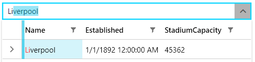
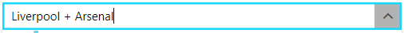
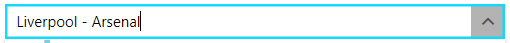
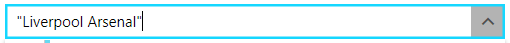
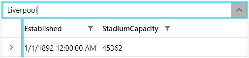
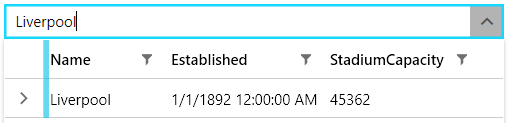

# Search As You Type

`RadMultiColumnComboBox` allows you to filter the data of the `RadGridView` control that is present in its drop-down menu. This is done via the input box of the RadMultiColumnComboBox control.

>important The default searching behavior has two ways of setting the operator of the filtering criteria. This will depend on the value type of the property, over which the search is performed. For a `string` and `Enum` type the operator is set to __Contains__. For all other types, the operator is set to __IsEqualTo__.

__RadMultiColumnComboBox with a performed search__



## Modify the Searching Criteria

In order to modify the search behavior, you can benefit from the following three search operators:

* __+__&mdash;The items that will pass the filtering operation will have to contain both the value before the operator and the one after it.

    __Using the `+` search operatior__

    

* __-__&mdash;All items that will pass the filtering operation will have to contain the value before the operator, but not the one after it.
    
    __Using the `-` search operatior__

    

* __""__&mdash;When a word or a phrase is put in quotes, the filtered objects will contain only the exact same value.

    __Using the `""` search operator__

    

## Search Mode

The RadMultiColumnComboBox control exposes the `SearchMode` property, which allows you to control how items are matched when a search is executed. 

This property exposes two possible values:

* `MatchAnyTerm`&mdash;Items match the search operation when they fulfill any of the search terms. For example, if `Liverpool Arsenal` is inputted in the search panel, items containing any of the terms "Liverpool" and "Arsenal" in any of their properties will be matched. This is the default value.

* `MatchAllTerms`&mdash;Items match the search operation only when they fulfill all of the search terms. Continuing with the previous example, if `Liverpool Arsenal` is entered as the search text, only items that contain both terms ("Liverpool" and "Arsenal") in any of their properties will be matched.

* `MatchExact`&mdash;Items match the search operation only when they exactly match the search text. When this mode is selected the append provider won't append text. This option is available with the __2023 R2__ release of Telerik UI for WPF and versions above it.

## Search in Hidden Columns

RadMultiComboBox allows you to search in hidden columns. To do so, set the `CanUserSearchInHiddenColumns` property to __True__ of the `GridViewItemsSourceProvider` instance.

__Enable searching in hidden columns__
```XAML
    <telerik:RadMultiColumnComboBox>
        <telerik:RadMultiColumnComboBox.ItemsSourceProvider>
            <telerik:GridViewItemsSourceProvider ItemsSource="{Binding Clubs}" 
                                                 AutoGenerateColumns="False" 
                                                 CanUserSearchInHiddenColumns="True">
                <telerik:GridViewItemsSourceProvider.Columns>
                    <telerik:GridViewDataColumn DataMemberBinding="{Binding Name}" IsVisible="False"/>
                    <telerik:GridViewDataColumn DataMemberBinding="{Binding Established}"/>
                    <telerik:GridViewDataColumn DataMemberBinding="{Binding StadiumCapacity}"/>
                </telerik:GridViewItemsSourceProvider.Columns>
            </telerik:GridViewItemsSourceProvider>
        </telerik:RadMultiColumnComboBox.ItemsSourceProvider>
    </telerik:RadMultiColumnComboBox>
```

__RadMultiColumnComboBox search in a hidden column__



## SearchStateManager

The RadMultiColumnComboBox exposes the `SearchStateManager` property, through which the search functionality can be customized.

The SearchStateManager property is of the type `SearchStateManager` and this class exposes the following properties:

* `MatchCase`&mdash;Allows you to control if the text matching will be case sensitive.
* `IsSearchWithAccentEnabled`&mdash;Allows you to specify if the search will be accent sensitive.
* `HighlightMatches`&mdash;Allows you to control if the matched items will be highlighted.
* `AutoCompleteMode`&mdash;Allows you to specify the auto-complete mode of the input box. 
    This property is of the type `SearchAutoCompleteMode`, which is an enumeration and exposes the following options:
    * `Suggest`&mdash;Items are filtered, text is not auto-completed. String are filtered by __StartsWith__ operator.
    * `Append`&mdash;Items are not filtered, text is auto-completed. String are filtered by __StartsWith__ operator.
    * `SuggestAppend`&mdash;Items are filtered, text is auto-completed. String are filtered by __StartsWith__ operator. This is the default value of the `AutoCompleteMode` property.
    * `Search`&mdash;Items are filtered, text is not auto-completed. String are filtered by __Contains__ operator. Complex clause searches are supported (Like RadGridView search as you type).

__Disabling the highlighting effect on matched items__
```C#
    this.radMultiColumnComboBox.SearchStateManager.HighlightMatches = false;
```
```VB.NET
    Me.radMultiColumnComboBox.SearchStateManager.HighlightMatches = False
```

__RadMultiColumnComboBox without highlighting on matched items__



## See Also
* [Auto Complete]()
* [Selection]()
