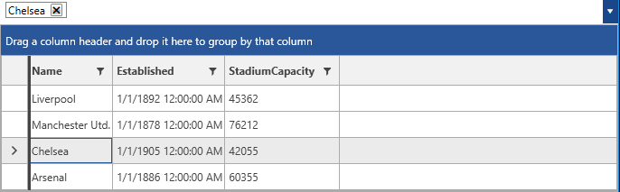
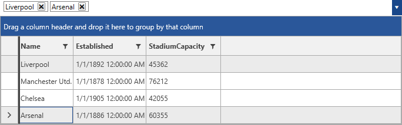

# Selection

The selection in the AutoCompleteBox will display the property of the selected item to which the __DisplayMemberPath__ points. 

#### Figure 1: Default Selection


Furthermore, the control exposes the following properties and events for handling the user selection.

 * __SelectedItem__: Gets or sets the data item that is selected.
 * __SelectedItems__: Gets the data items that participate in the selection. It is useful in case multiple selection is used.
 * __SelectedValue__: Gets or sets the selected property value.
 * __SelectedIndex__: Gets or sets the index of the selected item.
 * __SelectedValuePath__: Gets or sets the property path of the property used for the selected value.

## Multiple Selection

By default, __RadMultiColumnComboBox__ will perform a single selection. In order to enable a multiple selection, the __SelectionMode__ of the control can be set to __Multiple__.

__Example 1: Setting the SelectionMode to Multiple__
```XAML
	<telerik:RadMultiColumnComboBox VerticalAlignment="Top" DisplayMemberPath="Name" SelectionMode="Multiple">
            <telerik:RadMultiColumnComboBox.ItemsSourceProvider>
                <telerik:GridViewItemsSourceProvider ItemsSource="{Binding Clubs, Source={StaticResource MyViewModel}}"/>
            </telerik:RadMultiColumnComboBox.ItemsSourceProvider>
        </telerik:RadMultiColumnComboBox>
```

#### Figure 2: Multiple Selection


## SelectionChanged event

Each time a select or deselect operation is applied, the __SelectionChanged__ event will be fired.

__Example 2: Handling the SelectionChanged event__
```XAML
		private void RadMultiColumnComboBox_SelectionChanged(object sender, SelectionChangeEventArgs e)
        {
            
        }
```

The event arguments expose the following collections.

* __AddedItems__: a collection of the item(s) that has/have been added to the selection
* __RemovedItems__: a collection of the item(s) that has/have been removed from the selection

## See Also

* [AutoComplete]()
