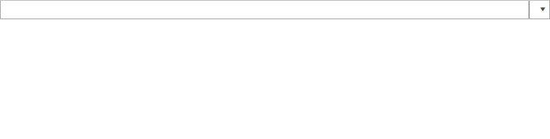
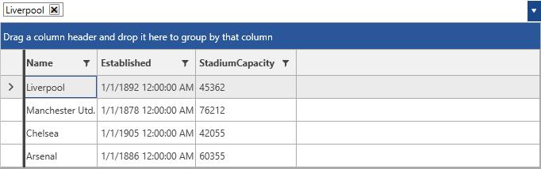

# Getting Started with {{ site.framework_name }} MultiColumnComboBox

This tutorial will walk you through the required steps for using __RadMultiColumnComboBox__. 

* [Adding Telerik Assemblies Using NuGet](#adding-telerik-assemblies-using-nuget)
* [Adding Assembly References Manually](#adding-assembly-references-manually)
* [Adding RadMultiColumnComboBox to the Project](#adding-radmulticolumncombobox-to-the-project)

## Adding Telerik Assemblies Using NuGet

To use __RadMultiColumnComboBox__ when working with NuGet packages, install the `Telerik.Windows.Controls.GridView.for.Wpf.Xaml` package. The [package name may vary]() slightly based on the Telerik dlls set - [Xaml or NoXaml]()

Read more about NuGet installation in the [Installing UI for WPF from NuGet Package]() article.

>tip With the 2025 Q1 release, the Telerik UI for WPF has a new licensing mechanism. You can learn more about it [here]().

## Adding Assembly References Manually

If you are not using NuGet packages, you can add a reference to the following assemblies:

* __Telerik.Licensing.Runtime__
* __Telerik.Windows.Controls__
* __Telerik.Windows.Controls.GridView__
* __Telerik.Windows.Controls.Input__
* __Telerik.Windows.Data__

## Adding RadMultiColumnComboBox to the Project

__Example 1: Defining RadMultiColumnComboBox Declaratively__
```XAML
	<telerik:RadMultiColumnComboBox VerticalAlignment="Top">
    </telerik:RadMultiColumnComboBox>
```

#### __Figure 1: Defining RadMultiColumnComboBox__


Note, that such definition would simply result in having an AutoComplete box. In order to have the actual __RadGridView__ populated as a Content of the DropDown the __GridViewItemsSourceProvider__ needs to be set as an __ItemsSourceProvider__. Note, that the __DisplayMemberPath__ property of __RadMultiColumnComboBox__ is also set. Its purpose is to point to a property of the bound data item present in the source collection of the ItemsSourceProvider. Thus, the control will be aware what value to display in the __AutoCompleteBox__. If not set, the control would simply call the __ToString__ method of the bound item.

#### __[XAML] Example 2: Setting the GridViewItemsSourceProvider
```XAML
	 <telerik:RadMultiColumnComboBox VerticalAlignment="Top" DisplayMemberPath="Name">
            <telerik:RadMultiColumnComboBox.ItemsSourceProvider>
                <telerik:GridViewItemsSourceProvider ItemsSource="{Binding Clubs}" />
            </telerik:RadMultiColumnComboBox.ItemsSourceProvider>
        </telerik:RadMultiColumnComboBox>
```

This definition will have the following output. 

#### __Figure 2: Setting the GridViewItemsSourceProvider__



## Telerik UI for WPF Learning Resources

* [Telerik UI for WPF MultiColumnComboBox Component](https://www.telerik.com/products/wpf/multicolumncombobox.aspx)
* [Getting Started with Telerik UI for WPF Components]()
* [Telerik UI for WPF Installation]()
* [Telerik UI for WPF and WinForms Integration]()
* [Telerik UI for WPF Visual Studio Templates]()
* [Setting a Theme with Telerik UI for WPF]()
* [Telerik UI for WPF Virtual Classroom (Training Courses for Registered Users)](https://learn.telerik.com/learn/course/external/view/elearning/16/telerik-ui-for-wpf) 
* [Telerik UI for WPF License Agreement](https://www.telerik.com/purchase/license-agreement/wpf-dlw-s)


## See Also

* [Overview]()
