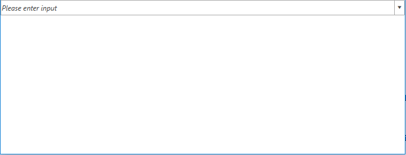

# Key Properties and Methods

The article lists the most important properties and methods of __RadMultiColumnComboBox__.

## Text Change Without Delay

By default, the reaction of __RadMultiColumnComboBox__ to a text change will be deferred. In case when updating needs to be done immediately, the __DeferTextChange__ property can be set to __False__.

## Disable Items Highlighting 

With all settings for its __AutoCompleteMode, RadMultiColumnComboBox__ will highlight its items. This can be switched off by setting the __HighlightMatches__ property to __False__.

## Setting Text for an Empty Selection

When there is no selection applied, the control will display an empty AutoCompleteBox. In case a custom text needs to be displayed in it, the __NullText__ property comes in handy.

__Example 1: Setting the NullText property__
```XAML
	<telerik:RadMultiColumnComboBox VerticalAlignment="Top" DisplayMemberPath="Name" 
                                         NullText="Please enter input">
            <telerik:RadMultiColumnComboBox.ItemsSourceProvider>
                <telerik:GridViewItemsSourceProvider ItemsSource="{Binding Clubs, Source={StaticResource MyViewModel}}"/>
            </telerik:RadMultiColumnComboBox.ItemsSourceProvider>
        </telerik:RadMultiColumnComboBox>
```

#### __Figure 1: MultiColumnComboBox with NullText set__


## Open,Close and Toggle the DropDown

The following set of methods is provided for manipulating the visibility of the DropDown.

* __OpenDropDown__: Opens the DropDown if it is closed.
* __CloseDropDown__: Closes the DropDown if it is opened.
* __ToggleDropDown__: Toggles the opened/closed state of the DropDown.

## DropDownElementStyle

Since __R1 2019 SP1__, RadMultiColumnComboBox exposes the __DropDownElementStyle__ property. Through it, you can get or set a Style that will be applied to the dropdown element.

> The TargetType of the Style should match the type of the dropdown element.

## Search Mode

With **R2 2019** we introduced a new **SearchMode** property which allows you to control how items are matched when search is executed. It has the following two possible values:

* **MatchAnyTerm**: Items match the search operation when they fulfill any of the search terms. For example, if `John Terry` is inputted, items containing **any** of the terms "John" and "Terry" in any of their properties will be matched. This is the **default** value.
* **MatchAllTerms**: Items match the search operation only when they fulfill all of the search terms. Continuing with the previous example, if `John Terry` is entered as the search text, only items which contain **both** terms ("John" and "Terry") in any of their properties will be matched.

>important The SearchMode property takes effect only if the **AutoCompleteMode** of the control is **Search**.

## SelectionOnFocus

With the **R3 2020 SP1 version**, the __SelectionOnFocus__ property of the __RadMultiColumnComboBox__ control was introduced, which allows you to specify what will happen with the cursor when the control gets focus. 

> This property is respected when the **SelectionBoxesVisibility** property is set to **Collapsed**.

The values for the __SelectionOnFocus__ property are predefined in the __SelectionOnFocus__ enumeration. It exposes the following members:				

* __SelectAll__: Once the control is focused, it will select its whole text. 				

* __CaretToBeginning__: Once the control is focused, the cursor will be positioned at its beginning.		

* __CaretToEnd__: Once the control is focused, the cursor will be positioned at its end.

* __Unchanged__: Once the control is focused, the cursor's position won't be changed. This is the __default value__ for the __SelectionOnFocus__ property.

* __Default__: Once the control is focused, the cursor will be positioned at its end.

* __DefaultSelectAll__: This property changes the __SelectionOnFocus__ behavior of the control depending on the source of the focus. If the control is focused on mouse click, the __Default SelectionOnFocus__ behavior will be used. If, on the other hand, the control is focused using the __Tab__ key, the __SelectAll SelectionOnFocus__ behavior will be used.

## See Also

* [Getting Started]()
* [DropDown Properties]()
