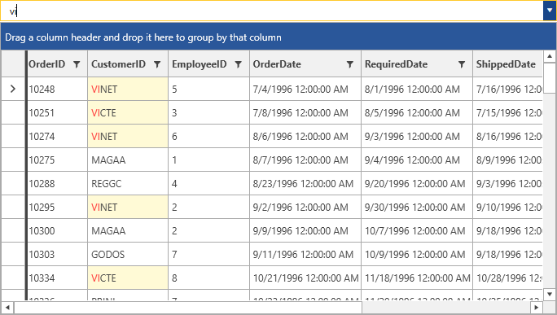

# {{ site.framework_name }} MultiColumnComboBox Overview

__RadMultiColumnComboBox__ is a special case of a ComboBox control. Its main advantage is that it can display more than a single property. This is done by generating the needed amount of columns for the RadGridView integrated as its drop down.





#### __Figure 1: RadMultiColumnComboBox__

## Key Features

* Selection and navigation
* Filtering
* AutoComplete
* Most common features supported by RadGridView
* Customizable DropDown
* Customizable appearance and theming support


## Telerik UI for WPF Support and Learning Resources

* [Telerik UI for WPF MultiColumnComboBox Homepage](https://www.telerik.com/products/wpf/multicolumncombobox.aspx)
* [Get Started with the Telerik UI for WPF MultiColumnComboBox]()
* [Telerik UI for WPF API Reference](https://docs.telerik.com/devtools/wpf/api/)
* [Getting Started with Telerik UI for WPF Components]()
* [Telerik UI for WPF Virtual Classroom (Training Courses for Registered Users)](https://learn.telerik.com/learn/course/external/view/elearning/16/telerik-ui-for-wpf) 
* [Telerik UI for WPF MultiColumnComboBox Forums](https://www.telerik.com/forums/wpf)
* [Telerik UI for WPF Knowledge Base](https://docs.telerik.com/devtools/wpf/knowledge-base)


## See Also

* [Getting Started]()
