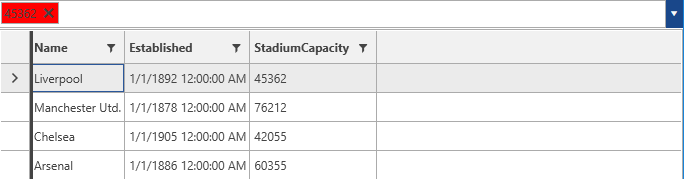
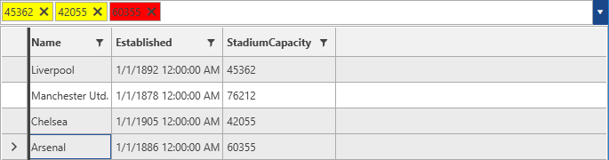

# SelectionBox Styles And Templates

__RadMultiColumnComboBox__ exposes API for controlling the appearance of its SelectionBoxes. This can be achieved through the following mechanisms.

> The Visibility of the SelectionBoxes can be controlled through the __SelectionBoxesVisibility__ enumeration. By default they will be visible.

* [SelectionBoxStyle](#selectionboxstyle)
* [SelectionBoxStyleSelector](#selectionboxstyleselector)
* [SelectionBoxTemplate](#selectionboxtemplate)
* [SelectionBoxTemplateSelector](#selectionboxtemplateselector)

## SelectionBoxStyle

Styling the SelectionBoxes can be achieved by defining a Style targeting the __SearchAutoCompleteBoxItem__ element. In case when it needs to be applied as an explicit one, the __SelectionBoxStyle__ property of __RadMultiColumnComboBox__ comes in handy.

__Example 1: Defining a Style targeting the SearchAutoCompleteBoxItem element__
```XAML
	<Window.Resources>
		<Style TargetType="telerik:SearchAutoCompleteBoxItem" x:Key="selectionBoxStyle">
            <Setter Property="Background" Value="Red"/>
        </Style>
	</Window.Resources>
	 
	 <telerik:RadMultiColumnComboBox SelectionBoxStyle="{StaticResource selectionBoxStyle}"/>
```

#### __Figure 1: Setting a Background for the SelectionBox__


## SelectionBoxStyleSelector

The __SelectionBoxStyleSelector__ can be used in cases when a conditional __Style__ for each __SelectionBox__ is needed. For the purpose of this example the following implementation will be used.

__Example 2: Implementing a SelectionBoxStyleSelector__
```C#
	public class MySelectionBoxStyleSelector: StyleSelector
    {
        public override Style SelectStyle(object item, DependencyObject container)
        {
            if (item is Club)
            {
                Club club = item as Club;
                if (club.StadiumCapacity > 50000)
                {
                    return BigStadiumStyle;
                }
                else
                {
                    return SmallStadiumStyle;
                }
            }
            return null;
        }
        public Style BigStadiumStyle { get; set; }
        public Style SmallStadiumStyle { get; set; }
    }
```

__Example 3: Adding the StyleSelector in XAML__
```XAML
	 <Window.Resources>
        <my:MySelectionBoxStyleSelector x:Key="selectionBoxStyleSelector">
            <my:MySelectionBoxStyleSelector.BigStadiumStyle>
                <Style TargetType="telerik:SearchAutoCompleteBoxItem">
                    <Setter Property="Background" Value="Red"/>
                </Style>
            </my:MySelectionBoxStyleSelector.BigStadiumStyle>
            <my:MySelectionBoxStyleSelector.SmallStadiumStyle>
                <Style TargetType="telerik:SearchAutoCompleteBoxItem">
                    <Setter Property="Background" Value="Yellow"/>
                </Style>
            </my:MySelectionBoxStyleSelector.SmallStadiumStyle>
        </my:MySelectionBoxStyleSelector>
	</Window.Resources>

	 <telerik:RadMultiColumnComboBox SelectionBoxStyleSelector="{StaticResource selectionBoxStyleSelector}"/>
```

The final result will be similar to the one illustrated below.

#### __Figure 2: RadMultiColumnComboBox with applied SelectionBoxStyleSelector__


## SelectionBoxTemplate

The __SelectionBoxTemplate__ can be used in case a custom control needs to be defined as a template for the SelectionBox. It can be applied through the __SelectionBoxTemplate__ property of __RadMultiColumnComboBox__.

__Example 4: Defining a SelectionBoxTemplate__
```C#
	<DataTemplate x:Key="selectionBoxTemplate">
            <TextBox Text="{Binding ., Mode=TwoWay}"/>
    </DataTemplate>
```

## SelectionBoxTemplateSelector

Through the __SelectionBoxTemplateSelector__ a different data template can be applied conditionally for the SelectionBoxes. An implementation similar to the one for the SelectionBoxStyleSelector can be used.

__Example 5: Implementing a SelectionBoxTemplateSelector__
```C#
	public class MyCellTemplateSelector : DataTemplateSelector 
	{ 
	    public override System.Windows.DataTemplate SelectTemplate(object item, System.Windows.DependencyObject container) 
	    { 
	        if (item is Club) 
	        { 
	            Club club = item as Club; 
	            if (club.StadiumCapacity > 50000) 
	            { 
	                return bigStadium; 
	            } 
	            else 
	            { 
	                return smallStadium; 
	            } 
	        } 
	        return null; 
	    } 
    	public DataTemplate bigStadium { get; set; } 
    	public DataTemplate smallStadium { get; set; } 
	} 
```

The, the __SelectionBoxTemplateSelector__ can be added similarly to the __SelectionBoxStyleSelector__.

## See Also

* [Getting Started]()
* [DropDown Properties]()
* [Key Properties and Methods]()
