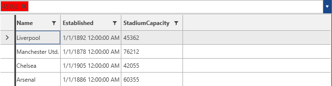
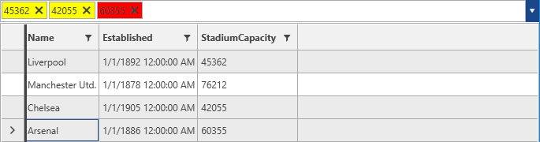

# SelectionBox Styles And Templates

__RadMultiColumnComboBox__ exposes API for controlling the appearance of its SelectionBoxes. This can be achieved through the following mechanisms.

> The Visibility of the SelectionBoxes can be controlled through the __SelectionBoxesVisibility__ enumeration. By default they will be visible.

* [SelectionBoxStyle](#selectionboxstyle)
* [SelectionBoxStyleSelector](#selectionboxstyleselector)
* [SelectionBoxTemplate](#selectionboxtemplate)
* [SelectionBoxTemplateSelector](#selectionboxtemplateselector)

## SelectionBoxStyle

Styling the SelectionBoxes can be achieved by defining a Style targeting the __SearchAutoCompleteBoxItem__ element. In case when it needs to be applied as an explicit one, the __SelectionBoxStyle__ property of __RadMultiColumnComboBox__ comes in handy.

__Example 1: Defining a Style targeting the SearchAutoCompleteBoxItem element__
<snippet id='radmulticolumncombobox-selectionbox-styles-and-templates-block_1-xaml' />

#### __Figure 1: Setting a Background for the SelectionBox__

## SelectionBoxStyleSelector

The __SelectionBoxStyleSelector__ can be used in cases when a conditional __Style__ for each __SelectionBox__ is needed. For the purpose of this example the following implementation will be used.

__Example 2: Implementing a SelectionBoxStyleSelector__
<snippet id='radmulticolumncombobox-selectionbox-styles-and-templates-block_2-cs' />

__Example 3: Adding the StyleSelector in XAML__
<snippet id='radmulticolumncombobox-selectionbox-styles-and-templates-block_3-xaml' />

The final result will be similar to the one illustrated below.

#### __Figure 2: RadMultiColumnComboBox with applied SelectionBoxStyleSelector__

## SelectionBoxTemplate

The __SelectionBoxTemplate__ can be used in case a custom control needs to be defined as a template for the SelectionBox. It can be applied through the __SelectionBoxTemplate__ property of __RadMultiColumnComboBox__.

__Example 4: Defining a SelectionBoxTemplate__
<snippet id='radmulticolumncombobox-selectionbox-styles-and-templates-block_4-cs' />

## SelectionBoxTemplateSelector

Through the __SelectionBoxTemplateSelector__ a different data template can be applied conditionally for the SelectionBoxes. An implementation similar to the one for the SelectionBoxStyleSelector can be used.

__Example 5: Implementing a SelectionBoxTemplateSelector__
<snippet id='radmulticolumncombobox-selectionbox-styles-and-templates-block_5-cs' />

The, the __SelectionBoxTemplateSelector__ can be added similarly to the __SelectionBoxStyleSelector__.

## See Also

* [Getting Started]()
* [DropDown Properties]()
* [Key Properties and Methods]()