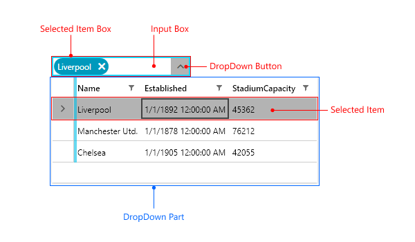

# Visual Structure

This section defines terms and concepts used in the scope of `RadMultiColumnComboBox` that you need to get familiar with prior to continue reading this help. They can also be helpful when contacting our support service in order to describe your issue better. Below you can see snapshots and explanations of the main states and visual elements of the standard `RadMultiColumnComboBox` control.  

* __Selected Item Box__&mdash;Each selected item of the RadMultiColumnComboBox is presented in a separate selection box.
* __Input Box__&mdash;The input box is used to perform a search operation on the RadGridView component that is used in the drop-down part of RadMultiColumnComboBox.
* __DropDown Button__&mdash;Opens/closes the drop-down part of the RadMultiColumnComboBox control.
* __Selected Item__&mdash;The selected item in the RadGridView control.
* __DropDown Part__&mdash;The drop-down menu that hosts the RadGridView component, which the RadMultiColumnComboBox control utilizes.

>tip Get started with the control with its [Getting Started]() help article that shows how to use it in a basic scenario.

## See Also
* [Getting Started]()