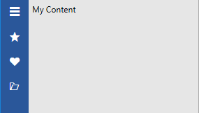
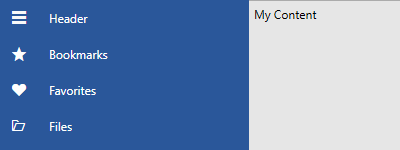
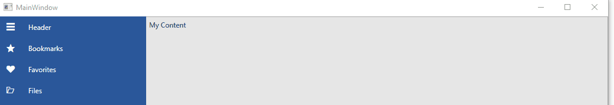

# Display Mode

The `RadNavigationView` control dynamically adjusts its layout depending on its size. It has three modes __Minimal__, __Compact__ and __Expanded__. 

__RadNavigationView in Minimal DisplayMode in the Office2016 theme__


__RadNavigationView in Compact DisplayMode in the Office2016 theme__



__RadNavigationView in Expanded DisplayMode in the Office2016 theme__



## DisplayMode Thresholds

By default the RadNavigationView changes its DisplayMode when its size passes certain thresholds. Those are the `CompactModeThresholdWidth` and `ExpandedModeThresholdWidth`.  When the width of the control reaches these thresholds, its `DisplayMode` changes. The default value for CompactModeThresholdWidth is __641__ and the default value for  ExpandedModeThresholdWidth is __1008__. You can modify these values to customize the adaptive display mode behavior. 

The following GIF illustrates how the DisplayMode changes while resizing.

__RadNavigationView DisplayModes__



## AutoChangeDisplayMode

By default, the RadNavigationView handles its `SizeChanged` event in order to change its DisplayMode based on the values of the CompactModeThresholdWidth and ExpandedModeThresholdWidth properties. If you do not want this to be the case, you can set the `AutoChangeDisplayMode` property to __False__ as demonstrated in the next example.

__Setting the AutoChangeDisplayMode to False in xaml__
```XAML
    <telerik:RadNavigationView x:Name="navigationView" AutoChangeDisplayMode="False" />
```

## See Also

* [Getting Started]()
* [DataBinding]()
* [Icon and IconTemplate]()