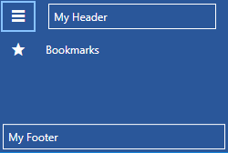

# Header and Footer

The RadNavigationView's header and footer parts are fully customizable. This article will demonstrate how this can be achieved.

## Customizing the Header

RadNavigationView's header can be customized with the following properties: __PaneHeader__, __PaneHeaderTemplate__ and __PaneHeaderHeight__. __Example 1__ demonstrates how you set the RadNavigationView's PaneHeader property.

__Example 1: Setting the PaneHeader property__
```XAML
     <telerik:RadNavigationView PaneHeader="My Header" />
```

#### __Figure 1: Result from Example 1 in the Office 2016 theme__


It is possible to further customize the header by setting the __PaneHeaderTemplate__ property. The DataContext inside the PaneHeaderTemplate will be whatever is set to the PaneHeader property of the RadNavigationView. __Example 2__ demonstrates how you can set this property along with the __PaneHeaderHeight__ property which controls the height of the pane header.

__Example 2: Setting the PaneHeaderTemplate and PaneHeaderHeight properties__
```XAML
    <Grid>
        <Grid.Resources>
            <DataTemplate x:Key="PaneHeaderTemplate">
                <Border BorderBrush="White" BorderThickness="1" Margin="3">
                    <TextBlock Text="{Binding}" Margin="5"/>
                </Border>
            </DataTemplate>
        </Grid.Resources>

        <telerik:RadNavigationView PaneHeader="My Header" PaneHeaderTemplate="{StaticResource PaneHeaderTemplate}" PaneHeaderHeight="35">
            <telerik:RadNavigationView.Items>
                <telerik:RadNavigationViewItem Content="Bookmarks">
                    <telerik:RadNavigationViewItem.Icon>
                        <telerik:RadGlyph Glyph="&#xe303;" FontSize="16"/>
                    </telerik:RadNavigationViewItem.Icon>
                </telerik:RadNavigationViewItem>
            </telerik:RadNavigationView.Items>
        </telerik:RadNavigationView>
    </Grid>
```

#### __Figure 2: Result from Example 2 in the Office 2016 theme__


> The pane header's Background and Foreground can also be changed with the __PaneHeaderBackground__ and __PaneHeaderForeground__ properties.

`RadNavigationView` also exposes a `PaneHeaderTemplateSelector` property which allows you to specify a different data template based on the value of the `Header` property.

## Customizing the Footer

RadNavigationView's footer can be customized with the following properties: __PaneFooter__, __PaneFooterTemplate__. The approach for doing so is identical to customizing its header which is described in the previous section.

__Example 3: Setting the PaneFooter and PaneFooterTemplate properties__
```XAML
    <Grid>  
        <Grid.Resources>
            <DataTemplate x:Key="PaneHeaderTemplate">
                <Border BorderBrush="White" BorderThickness="1" Margin="3">
                    <TextBlock Text="{Binding}" Margin="5"/>
                </Border>
            </DataTemplate>

            <DataTemplate x:Key="PaneFooterTemplate">
                <Border BorderBrush="White" BorderThickness="1" Margin="3">
                    <TextBlock Text="{Binding}" Margin="5"/>
                </Border>
            </DataTemplate>
        </Grid.Resources>
    

        <telerik:RadNavigationView PaneHeader="My Header" PaneHeaderTemplate="{StaticResource PaneHeaderTemplate}" PaneFooter="My Footer" PaneFooterTemplate="{StaticResource PaneFooterTemplate}">
            <telerik:RadNavigationView.Items>
                <telerik:RadNavigationViewItem Content="Bookmarks">
                    <telerik:RadNavigationViewItem.Icon>
                        <telerik:RadGlyph Glyph="&#xe303;" FontSize="16"/>
                    </telerik:RadNavigationViewItem.Icon>
                </telerik:RadNavigationViewItem>
            </telerik:RadNavigationView.Items>
        </telerik:RadNavigationView>
    </Grid>
```

#### __Figure 3: Result from Example 3 in the Office 2016 theme__


`RadNavigationView` also exposes a `PaneFooterTemplateSelector` property which allows you to specify a different data template based on the value of the `Footer` property.

## Define Items and Subitems in the Footer

As of **R3 2020**, you can also define RadNavigationViewItems in the footer section of the control. For the items to function as expected, participate in the selection of the control, and hold subitems, however, you need to place them inside of a **NavigationViewSubItemsHost**.

__Example 4: Place items in the footer__
```XAML
    <DataTemplate x:Key="PaneFooterTemplate">
        <telerik:NavigationViewSubItemsHost>
            <telerik:RadNavigationViewItem Content="Footer Item 1">
                <telerik:RadNavigationViewItem.Items>
                    <telerik:RadNavigationViewItem Content="Footer SubItem 1" />
                    <telerik:RadNavigationViewItem Content="Footer SubItem 2" />
                </telerik:RadNavigationViewItem.Items>
            </telerik:RadNavigationViewItem>
            <telerik:RadNavigationViewItem Content="Footer Item 2" />
            <telerik:RadNavigationViewItem Content="Footer Item 3" />
        </telerik:NavigationViewSubItemsHost>
    </DataTemplate>
```

## Customizing the Pane Toggle Button

RadNavigationView has a RadToggleButton next to its header which allows for expanding or closing the navigation pane. This button is specially designed to show [RadGlyphs]() ,since it has a RadGlyph in its ContentTemplate. You can easily change which glyph is displayed by setting the __PaneToggleButtonContent__ property to the desired [glyph string](). __Example 4__ demonstrates how this can be achieved.

__Example 5: Setting the PaneToggleButtonContent__
```XAML
     <telerik:RadNavigationView x:Name="navigationView" PaneHeader="Header" PaneToggleButtonContent="&#xe301;" />
```

#### __Figure 4: Result from Example 4 in the Office 2016 theme__


If do not want to show a RadGlyph as the Content of the toggle button, you can modify the __PaneToggleButtonContentTemplate__ as demosntrated in __Example 5__.

__Example 6: Setting the PaneToggleButtonContentTemplate__
```XAML
    <DataTemplate x:Key="PaneToggleButtonContentTemplate">
        <Rectangle Width="15" Height="15" Fill="White" />
    </DataTemplate>

     <telerik:RadNavigationView x:Name="navigationView" PaneHeader="Header" PaneToggleButtonContentTemplate="{StaticResource PaneToggleButtonContentTemplate}" />
```

#### __Figure 5: Result from Example 5 in the Office 2016 theme__


>The Pane Toggle Button can be customized further by setting the __PaneToggleButtonStyle__ property. It can also be hidden by setting the __PaneToggleButtonVisibility__ property.

## See Also

* [Getting Started]()
* [DataBinding]()
* [Display Mode]()
* [Icon and IconTemplate]()