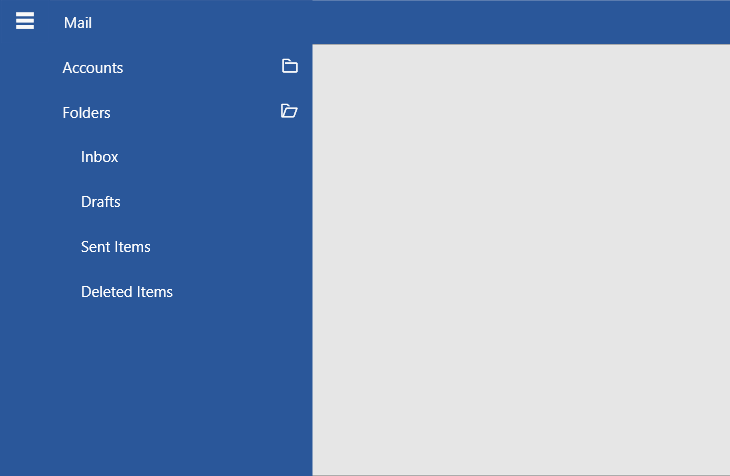
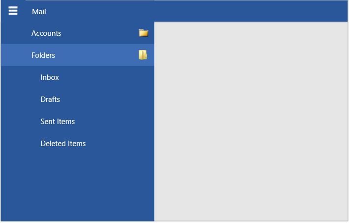
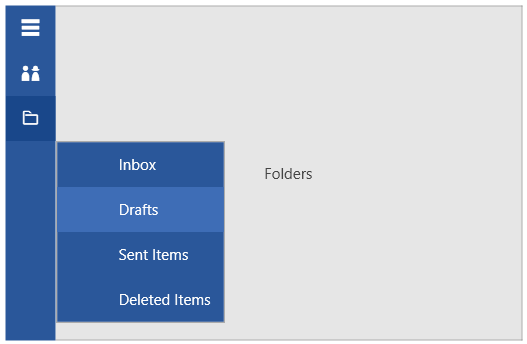

# Hierarchy

RadNavigationView allows you to define sub-items in order to achieve hierarchical menu visualization.

Each RadNavigationViewItem element has an Items collection that can be populated with RadNavigationViewItem elements, thus allowing multiple levels of items to be defined in the hierarchy.

__Setting up hierarchical navigation view in XAML__
<snippet id='radnavigationview-features-hierarchy-block_1-xaml' />

To control the current expand state of a RadNavigationViewItem, set its __IsExpanded__ property.

__Hierarchical RadNavigationView__

## Multiple Expanded Items

By default, multiple RadNavigationViewItem elements with child items can be expanded at once. To change this and allow only a single expanded item, set the `AllowMultipleExpandedItems` property of RadNavigationView to False. 

__Disabling multiple expanded items at once__
<snippet id='radnavigationview-features-hierarchy-block_2-xaml' />

## Child Items Indentation

To change the default horizontal offset (indent) of the child items relative to their parent, set the `SubItemsIndentation` property of RadNavigationView.

__Setting the indent of sub items__
<snippet id='radnavigationview-features-hierarchy-block_3-xaml' />

__Sub items indentation set to 10__

## Expand and Collapse Icon

RadNavigationViewItem has default expand and collapse icons shown in the right part of the item when it has children. To replace the icons, set the `ExpandedIcon` and `CollapsedIcon` properties of RadNavigationViewItem. The default icon template uses [RadGlyph]() and you can set the properties to a glyph string from the [glyphs reference sheet]().

__Setting the expand and collapse icons__
<snippet id='radnavigationview-features-hierarchy-block_4-xaml' />

__RadNaviationViewItems with folder glyphs as expand/collapse icons__

To change this behavior and use other UI for the icons like a customized RadGlyph, an Image, or any other element, set the `ExpandedIconTemplate` and `CollapsedIconTemplate` properties. The properties expect DataTemplate values.

__Setting the expand and collapse icon templates__
<snippet id='radnavigationview-features-hierarchy-block_5-xaml' />

__RadNavigationViewItems with folder images as expand/collapse icons__

In data binding scenarios or when there are many items, you can use the `ItemContainerStyle` property to set the icon properties.

## Flyout 

When RadNavigationView is collapsed and its current [DisplayMode]() Compact, you can display the nested menu items by clicking on the collapsed RadNavigationViewItems.

__Sub menu flyout visualization__

## AllowSingleClickExpandInCompactMode

RadNavigationView exposes the `AllowSingleClickExpandInCompactMode` property. It allows you to choose if the top-level `RadNavigationViewItem` elements can expand with a single click when hosted in a [flyout](#flyout). The default value of the AllowSingleClickExpandInCompactMode property is __True__. If the property is set to false, two clicks will need to be performed, in order to open a different top-level RadNavigationViewItem element.

__Setting the AllowSingleClickExpandInCompactMode property__
<snippet id='radnavigationview-features-hierarchy-block_6-xaml' />

__RadNavigationView with two clicks to open a different top-level RadNavigationViewItem element__

## Events

The expanding and collapsing actions fire the `ItemExpanded` and `ItemCollapsed` events of RadNavigationView. 

Additionally, the RadNavigationViewItem exposes `Expanded` and `Collapsed` events.

__Subscribing to ItemExpanded event__
<snippet id='radnavigationview-features-hierarchy-block_7-xaml' />

__ItemExpanded event handler__
<snippet id='radnavigationview-features-hierarchy-block_8-cs' />

> The Expanded/Collapsed event of RadNavigationViewItem is fired before the ItemExpanded/ItemCollapsed event of RadNavigationView.

## Data Binding

RadNavigationViewItem exposes ItemsSource and few other data related properties that allow setting up the hierarchy in a data binding scenario. Read more about this in the [Hierarchical Data Binding]() article.

## See Also  
* [Getting Started]()
* [Display Mode]()
* [Events]()
* [Icon and IconTemplate]()