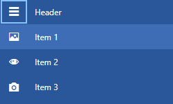

# Icon and IconTemplate

The __RadNavigationViewItem__ allows you to display a custom icon in its template. To show an icon, you can use either the Icon, or the IconTemplate properties.

## Icon

Since the __Icon__ property is of type object, you can set it to an image, glyph or any custom control. __Example 1__ demonstrates how you can set the Icon of __RadNavigationViewItem__ to a [RadGlyph]().

__Example 1: Setting the Icon of a RadNavigationViewItem__
```XAML
    <telerik:RadNavigationViewItem Content="Bookmarks" Width="200" Height="50" >
        <telerik:RadNavigationViewItem.Icon>
            <telerik:RadGlyph Glyph="&#xe303;" FontSize="16"/>
        </telerik:RadNavigationViewItem.Icon>
    </telerik:RadNavigationViewItem>
```

#### __Figure 1: Result from Example 1 in the Office2016 theme__


## IconTemplate

The __IconTemplate__ property is useful, because a single DataTemplate can be set to many __RadNavigationViewItems__. 
This section will demonstrate how this property can be used in a databinding scenario.

> Note that whatever is set to the Icon property will be the DataContext inside the IconTemplate.

First we will define a model for our items and a viewmodel which will hold a collection of those models. This is demonstrated in __Example 2__.

__Example 2: Defining a model and a viewmodel__
```C#
    public class MainViewModel
    {
        private readonly string[] glyphStrings = new string[] { "&#xe501;", "&#xe13d;", "&#xe500;" };

        public ObservableCollection<NavigationItemModel> Items { get; set; }

        public MainViewModel()
        {
            this.Items = new ObservableCollection<NavigationItemModel>();

            for (int i = 1; i <= 3; i++)
            {
                var glyphString = this.glyphStrings[i - 1];
                this.Items.Add(new NavigationItemModel() {Title = "Item " + i, IconGlyph = glyphString });
            }
        }
    }

    public class NavigationItemModel
    {
        public string Title { get; set; }
        public string IconGlyph { get; set; }
    }
```
```VB.NET
    Public Class MainViewModel
		Private ReadOnly glyphStrings() As String = { "&#xe501;", "&#xe13d;", "&#xe500;" }

		Public Property Items() As ObservableCollection(Of NavigationItemModel)

		Public Sub New()
			Me.Items = New ObservableCollection(Of NavigationItemModel)()

			For i As Integer = 1 To 3
				Dim glyphString = Me.glyphStrings(i - 1)
				Me.Items.Add(New NavigationItemModel() With {
					.Title = "Item " & i,
					.IconGlyph = glyphString
				})
			Next i
		End Sub
    End Class

	Public Class NavigationItemModel
		Public Property Title() As String
		Public Property IconGlyph() As String
	End Class
```

After that we can setup our __RadNavigationView__ and set its ItemsSource to an instance of our viewmodel. We also need to create a style targeting __RadNavigationViewItem__ in order to bind the properties of the NavigationItemModel class. Note, that a [StringToGlyphConverter](#stringtoglyphconverter) is used to convert the IconGlyph string property to a glyph. 

__Example 3: Setting up the view__
```XAML
    <Window.Resources>
        <local:MainViewModel x:Key="ViewModel" />
        <telerik:StringToGlyphConverter x:Key="StringToGlyphConverter" />

        <!-- If you are using the NoXaml binaries, you will have to base the style on the default one for the theme like so:
        <Style TargetType="telerik:RadNavigationViewItem" BasedOn="{StaticResource RadNavigationViewItemStyle}">-->

        <Style TargetType="telerik:RadNavigationViewItem">
            <Setter Property="Content" Value="{Binding Title}" />
            <Setter Property="Icon" Value="{Binding IconGlyph}" />
            <Setter Property="IconTemplate">
                <Setter.Value>
                    <DataTemplate>
                        <telerik:RadGlyph Glyph="{Binding Converter={StaticResource StringToGlyphConverter}}" />
                    </DataTemplate>
                </Setter.Value>
            </Setter>
        </Style>
    </Window.Resources>
    <Grid>
        <telerik:RadNavigationView DataContext="{StaticResource ViewModel}" ItemsSource="{Binding Items}" PaneHeader="Header" />
    </Grid>
```

#### __Figure 2: Result from Example 3 in the Office2016 theme__


>For a more extensive databinding example check out the [DataBinding]() article.

## IconTemplateSelector

RadNavigationViewItem exposes an **IconTemplateSelector** property which allows you to specify a different datatemplate based on the value of the **Icon** property. For example, you may display the icons by using multiple font families as shown in **Examples 4 and 5**. The examples demonstrate how to switch between the [TelerikWebUI]() and **Wingdings** fonts.

>For the purposes of this example, let's assume that the last string of the **glyphStrings** array from **Example 2** is changed to **&#x00fc**.

__Example 4: Defining the IconTemplateSelector__
```C#
    public class IconTemplateSelector : DataTemplateSelector
    {
        public DataTemplate TelerikWebUITemplate { get; set; }
        public DataTemplate WingdingsTemplate { get; set; }

        public override DataTemplate SelectTemplate(object item, DependencyObject container)
        {
            var icon = item.ToString();
            if (icon.StartsWith("&#xe"))
            {
                return this.TelerikWebUITemplate;
            }
            else
            {
                return this.WingdingsTemplate;
            }
        }
    }
```
```VB.NET
    Public Class IconTemplateSelector
        Inherits DataTemplateSelector

            Public Property TelerikWebUITemplate() As DataTemplate
            Public Property WingdingsTemplate() As DataTemplate

            Public Overrides Function SelectTemplate(ByVal item As Object, ByVal container As DependencyObject) As DataTemplate
                Dim icon = item.ToString()
                If icon.StartsWith("&#xe") Then
                    Return Me.TelerikWebUITemplate
                Else
                    Return Me.WingdingsTemplate
                End If
            End Function
    End Class
```

__Example 5: Using the IconTemplateSelector in XAML__
```XAML
    <Window.Resources>
        <telerik:StringToGlyphConverter x:Key="StringToGlyphConverter" />
        <Style TargetType="telerik:RadNavigationViewItem" BasedOn="{StaticResource RadNavigationViewItemStyle}">
            <Setter Property="Content" Value="{Binding Title}" />
            <Setter Property="Icon" Value="{Binding IconGlyph}" />
            <Setter Property="IconTemplateSelector">
                <Setter.Value>
                    <local:IconTemplateSelector>
                        <local:IconTemplateSelector.TelerikWebUITemplate>
                            <DataTemplate>
                                <telerik:RadGlyph Glyph="{Binding Converter={StaticResource StringToGlyphConverter}}" />
                            </DataTemplate>
                        </local:IconTemplateSelector.TelerikWebUITemplate>
                        <local:IconTemplateSelector.WingdingsTemplate>
                            <DataTemplate>
                                <telerik:RadGlyph Font="Wingdings" Width="16" Height="16" Glyph="{Binding}" />
                            </DataTemplate>
                        </local:IconTemplateSelector.WingdingsTemplate>
                    </local:IconTemplateSelector>
                </Setter.Value>
            </Setter>
        </Style>
    </Window.Resources>
```

#### __Figure 3: Result from Example 5 in the Office2016 theme__


## Icon Visibility

To show or hide the icon of RadNaviationViewItem, set its __IconVisibility__ property.

__Example 6: Hiding the icon__
```XAML
    <telerik:RadNavigationViewItem IconVisibility="Collapsed" />
```

## See Also

* [DataBinding]()
* [Display Mode]()
