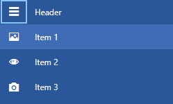
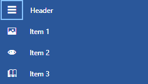

# Icon and IconTemplate

The __RadNavigationViewItem__ allows you to display a custom icon in its template. To show an icon, you can use either the Icon, or the IconTemplate properties.

## Icon

Since the __Icon__ property is of type object, you can set it to an image, glyph or any custom control. __Example 1__ demonstrates how you can set the Icon of __RadNavigationViewItem__ to a [RadGlyph]().

__Example 1: Setting the Icon of a RadNavigationViewItem__
<snippet id='radnavigationview-features-icon-and-icontemplate-block_1-xaml' />

#### __Figure 1: Result from Example 1 in the Office2016 theme__

## IconTemplate

The __IconTemplate__ property is useful, because a single DataTemplate can be set to many __RadNavigationViewItems__. 
This section will demonstrate how this property can be used in a databinding scenario.

> Note that whatever is set to the Icon property will be the DataContext inside the IconTemplate.

First we will define a model for our items and a viewmodel which will hold a collection of those models. This is demonstrated in __Example 2__.

__Example 2: Defining a model and a viewmodel__
<snippet id='radnavigationview-features-icon-and-icontemplate-block_2-cs' />
<snippet id='radnavigationview-features-icon-and-icontemplate-block_2-vb' />

After that we can setup our __RadNavigationView__ and set its ItemsSource to an instance of our viewmodel. We also need to create a style targeting __RadNavigationViewItem__ in order to bind the properties of the NavigationItemModel class. Note, that a [StringToGlyphConverter](#stringtoglyphconverter) is used to convert the IconGlyph string property to a glyph. 

__Example 3: Setting up the view__
<snippet id='radnavigationview-features-icon-and-icontemplate-block_3-xaml' />

#### __Figure 2: Result from Example 3 in the Office2016 theme__

>For a more extensive databinding example check out the [DataBinding]() article.

## IconTemplateSelector

RadNavigationViewItem exposes an **IconTemplateSelector** property which allows you to specify a different datatemplate based on the value of the **Icon** property. For example, you may display the icons by using multiple font families as shown in **Examples 4 and 5**. The examples demonstrate how to switch between the [TelerikWebUI]() and **Wingdings** fonts.

>For the purposes of this example, let's assume that the last string of the **glyphStrings** array from **Example 2** is changed to **&#x00fc**.

__Example 4: Defining the IconTemplateSelector__
<snippet id='radnavigationview-features-icon-and-icontemplate-block_4-cs' />
<snippet id='radnavigationview-features-icon-and-icontemplate-block_4-vb' />

__Example 5: Using the IconTemplateSelector in XAML__
<snippet id='radnavigationview-features-icon-and-icontemplate-block_5-xaml' />

#### __Figure 3: Result from Example 5 in the Office2016 theme__

## Icon Visibility

To show or hide the icon of RadNaviationViewItem, set its __IconVisibility__ property.

__Example 6: Hiding the icon__
<snippet id='radnavigationview-features-icon-and-icontemplate-block_6-xaml' />

## See Also

* [DataBinding]()
* [Display Mode]()