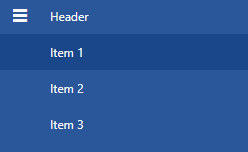

# Selection

The purpose of this article is to show the basic properties exposed by the __RadNavigationView__ for working with selection. 

## Using the SelectedItem

The SelectedItem property is used for getting or setting the currently selected item of the RadNavigationView. There are two common cases when accessing the SelectedItem property run-time. 

* When the __RadNavigationView__ is populated with static data (declared in XAML), the SelectedItem property is of type RadNavigationViewItem.

	__Example 1: Getting the SelectedItem of type RadNavigationViewItem__  
	```C#
		var selectedItem = this.navigationView.SelectedItem as RadNavigationViewItem;
	```
	```VB.NET
		Dim selectedItem = TryCast(Me.navigationView.SelectedItem, RadNavigationViewItem)
	```

* When your __RadNavigationView__ is [data bound to a collection of custom objects](), the SelectedItem is of the type of the custom object.     	
	__Example 2: Getting the SelectedItem of type custom object__  
	```C#
		var navigationModel = this.navigationView.SelectedItem as NavigationItemModel;
	```
	```VB.NET
		Dim navigationModel = TryCast(Me.navigationView.SelectedItem, NavigationItemModel)
	```

## Using SelectedValue and SelectedValuePath

The __SelectedValue__ property is used when you have linked the __RadNavigationView__ to a data source, and you want to return a value of one of the properties of the selected object. The __SelectedValuePath__ property provides a way to specify a __SelectedValue__ for the __SelectedItem__ in a __RadNavigationView__. There are two essential things to remember here:     	

* The __SelectedItem__ property represents an object in the Items collection.

* The __SelectedValuePath__ property specifies the path to the property that is used to determine the value of the __SelectedValue__ property.

>If SelectedValuePath is not specified, SelectedValue should be equal to SelectedItem.

__Examples 3 and 4__ demonstrate the usage of the __SelectedItem__, __SelectedValue__ and __SelectedValuePath__ properties.		

Let's assume that you have a business object named NavigationItemModel with one member(property): Title and a __RadNavigationView__ control which is [data bound]() to a list of NavigationItemModel objects. 

__Example 3: Business object and viewmodel__

```C#
	public class NavigationItemModel
    {
        public string Title { get; set; }
    }

    public class MainViewModel
    {
        public ObservableCollection<NavigationItemModel> Items { get; set; }

        public MainViewModel()
        {
            this.Items = new ObservableCollection<NavigationItemModel>();

            for (int i = 1; i <= 3; i++)
            {
                this.Items.Add(new NavigationItemModel() { Title = "Item " + i });
            }
        }
    }
```
```VB.NET
	Public Class NavigationItemModel
		Public Property Title() As String
    End Class

	Public Class MainViewModel
		Public Property Items() As ObservableCollection(Of NavigationItemModel)

		Public Sub New()
			Me.Items = New ObservableCollection(Of NavigationItemModel)()

			For i As Integer = 1 To 3
				Me.Items.Add(New NavigationItemModel() With {.Title = "Item " & i})
			Next i
		End Sub
	End Class
```

__Example 4: Initializing of RadNavigationView__

```XAML
	<Window.Resources>
        <local:MainViewModel x:Key="ViewModel" />

        <!-- If you are using the NoXaml binaries, you will have to base the style on the default one for the theme like so:
        <Style TargetType="telerik:RadNavigationViewItem" BasedOn="{StaticResource RadNavigationViewItemStyle}">-->
        
        <Style TargetType="telerik:RadNavigationViewItem" >
            <Setter Property="Content" Value="{Binding Title}" />
        </Style>
    </Window.Resources>

    <Grid>
        <telerik:RadNavigationView DataContext="{StaticResource ViewModel}" ItemsSource="{Binding Items}" PaneHeader="Header" SelectedValuePath="Title" />
    </Grid>
```

#### __Figure 1: Result from Example 4 in the Office2016 theme__


When you select a NavigationItemModel from the navigation view, the SelectedItem property returns the NavigationItemModel object. However, because the __SelectedValuePath__  is set to Title, the __SelectedValue__ property of the RadNavigationView is set to the Title property of the NavigationItemModel business object.   

SelectedValue is supported for the root level items only.

## Using the SelectedIndex

Using the __SelectedIndex__ property you can get or set the index of the selected item. For example, by using the __SelectedIndex__ property, you could specify which the default selected item is. 

__Example 5: Setting SelectedIndex__

```XAML
	<telerik:RadNavigationView SelectedIndex="3" />
```

SelectedIndex is supported for the root level items only. Selecting a child item from the [hierarchy]() will set the property to -1.

## RadNavigationViewItem Selection Properties

The __RadNavigationViewItem__ exposes two additional properties that help for working with selection. Those are the __IsSelected__ and __IsSelectable__ properties. Both are of type boolean and indicate whether an item is selected and whether it can be selected respectively.

__Example 6: Setting the IsSelectable property__

```XAML
    <telerik:RadNavigationView x:Name="navigationView" PaneHeader="Header">
        <telerik:RadNavigationView.Items>
            <telerik:RadNavigationViewItem IsSelectable="False" Content="Bookmarks" />
        </telerik:RadNavigationView.Items>
    </telerik:RadNavigationView>
```

>tip The __IsSelected__ and __IsSelectable__ properties can also be bound to properties in your model through a style targetting __RadNavigationViewItem__.

## See Also

* [Icon and IconTemplate]()
* [Header and Footer]()