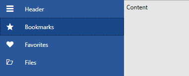
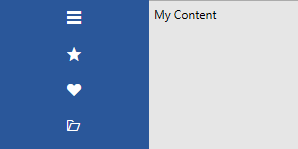

# Getting Started with {{ site.framework_name }} NavigationView

This tutorial walks you through the creation of a sample application that contains a __RadNavigationView__ control. We also demonstrate a few optional features.
			
## Adding Telerik Assemblies Using NuGet

To use __RadNavigationView__ when working with NuGet packages, install the `Telerik.Windows.Controls.Navigation.for.Wpf.Xaml` package. The [package name may vary]() slightly based on the Telerik dlls set - [Xaml or NoXaml]()

Read more about NuGet installation in the [Installing UI for WPF from NuGet Package]() article.

>tip With the 2025 Q1 release, the Telerik UI for WPF has a new licensing mechanism. You can learn more about it [here]().

## Adding Assembly References Manually

If you are not using NuGet packages, you can add a reference to the following assemblies:

* __Telerik.Licensing.Runtime__
* __Telerik.Windows.Controls__
* __Telerik.Windows.Controls.Navigation__
* __Telerik.Windows.Data__

>tip To find the required assemblies for each control, see the [Controls Dependencies]() article.

## Defining RadNavigationView

__Example 1__ demonstrates how you can define a RadNavigationView in xaml.

__Example 1: Defining RadNavigationView__
```XAML
    <telerik:RadNavigationView x:Name="navigationView"  />
```

## Populating with Items

Populate the control with items by adding RadNavigationViewItems to its Items collection:

__Example 2: Populating with Items in xaml__
```XAML
    <telerik:RadNavigationView x:Name="navigationView" PaneHeader="Header">
        <telerik:RadNavigationView.Items>
            <telerik:RadNavigationViewItem Content="Bookmarks">
                <telerik:RadNavigationViewItem.Icon>
                    <telerik:RadGlyph Glyph="&#xe303;" FontSize="16"/>
                </telerik:RadNavigationViewItem.Icon>
            </telerik:RadNavigationViewItem>
            <telerik:RadNavigationViewItem Content="Favorites">
                <telerik:RadNavigationViewItem.Icon>
                    <telerik:RadGlyph Glyph="&#xe301;" FontSize="16"/>
                </telerik:RadNavigationViewItem.Icon>
            </telerik:RadNavigationViewItem>
            <telerik:RadNavigationViewItem Content="Files">
                <telerik:RadNavigationViewItem.Icon>
                    <telerik:RadGlyph Glyph="&#xe901;" FontSize="16"/>
                </telerik:RadNavigationViewItem.Icon>
            </telerik:RadNavigationViewItem>
        </telerik:RadNavigationView.Items>
        <telerik:RadNavigationView.Content>
            <TextBlock Text="Content" Foreground="Black" Margin="5"/>
        </telerik:RadNavigationView.Content>
    </telerik:RadNavigationView>
```

Another way to populate RadNavigationView with items is to use data binding. See the [DataBinding]() article for details.

#### __Figure 1: Result from Example 1 in the Office 2016 theme__


>Check out the [Icon and IconTemplate]() article for more information on those properties. 

## Opening/Closing the NavigationPane in code

By default, users can open or close the NavigationPane that hosts the RadNavigationViewItems by clicking the RadToggleButton. You can manage the state of the control programmatically by setting the __IsPaneOpen__ property of the __RadNavigationView__. This is demonstrated in __Examples 3 and 4__:

__Example 3: Setting the IsPaneOpen property in xaml__
```XAML
     <telerik:RadNavigationView x:Name="navigationView" IsPaneOpen="True" />
```

__Example 4: Setting the IsPaneOpen property in code__
```C#
    this.navigationView.IsPaneOpen = true;
```
```VB.NET
    Me.navigationView.IsPaneOpen = True
```

## Changing the Width of the Navigation Pane

* To control the width of the NavigationPane when it's opened, use the __ExpandedPaneWidth__ property.

* To control the width of the NavigationPane when it's closed, use the __CompactPaneWidth__ property.

__Example 5__ demonstrates how you can set the  property in order to increase the default width when the navigation pane is closed.

__Example 5: Setting the CompactPaneWidth property__
```XAML
     <telerik:RadNavigationView x:Name="navigationView" PaneHeader="Header" CompactPaneWidth="150">
        <telerik:RadNavigationView.Items>
            <telerik:RadNavigationViewItem Content="Bookmarks">
                <telerik:RadNavigationViewItem.Icon>
                    <telerik:RadGlyph Glyph="&#xe303;" FontSize="16"/>
                </telerik:RadNavigationViewItem.Icon>
            </telerik:RadNavigationViewItem>
            <telerik:RadNavigationViewItem Content="Favorites">
                <telerik:RadNavigationViewItem.Icon>
                    <telerik:RadGlyph Glyph="&#xe301;" FontSize="16"/>
                </telerik:RadNavigationViewItem.Icon>
            </telerik:RadNavigationViewItem>
            <telerik:RadNavigationViewItem Content="Files">
                <telerik:RadNavigationViewItem.Icon>
                    <telerik:RadGlyph Glyph="&#xe901;" FontSize="16"/>
                </telerik:RadNavigationViewItem.Icon>
            </telerik:RadNavigationViewItem>
        </telerik:RadNavigationView.Items>
        <telerik:RadNavigationView.Content>
            <TextBlock Text="My Content" Foreground="Black" Margin="5"/>
        </telerik:RadNavigationView.Content>
    </telerik:RadNavigationView>
```

#### __Figure 2: Result from Example 5 in the Office 2016 theme__


## Navigation

__RadNavigationView__ doesn't perform any navigation automatically. To perform navigation-related tasks or change the content of the RadNavigationView control, you must handle either of the following events:

* The __ItemClick__ event that is raised when a user clicks a __RadNavigationViewItem__.

* The __SelectionChanged__ event that is raised when a user clicks a __RadNavigationViewItem__ and this results in the selection of a new item.

Alternatively, you can use the __SelectedItem__ property to change the content. This is demonstrated in the [DataBinding]() article.  

## More Features

To further customize __RadNavigationView__, you can also control:

* The DisplayMode.

    The __RadNavigationView__ control dynamically changes its layout based on its size. It has three display modes: __Minimal__, __Compact__ and __Expanded__. You can read more about them in the [Display Mode]() article.

* The PaneHeader and PaneFooter.

    The __RadNavigationView__ control allows you to customize its header and footer. You can set them to simple strings or add a custom control. Check out the [Header and Footer]() article for more information.
	
## Setting a Theme

The controls from our suite support different themes. You can see how to apply a theme different than the default one in the [Setting a Theme]() help article.

>important Changing the theme using implicit styles will affect all controls that have styles defined in the merged resource dictionaries. This is applicable only for the controls in the scope in which the resources are merged. 

To change the theme, you can follow the steps below:

* Choose between the themes and add reference to the corresponding theme assembly (ex: **Telerik.Windows.Themes.Windows8.dll**). You can see the different themes applied in the **Theming** examples from our [WPF Controls Examples](https://demos.telerik.com/wpf/) application.

* Merge the ResourceDictionaries with the namespace required for the controls that you are using from the theme assembly. For the __RadNavigationView__, you will need to merge the following resources:

	* __Telerik.Windows.Controls__
	* __Telerik.Windows.Controls.Navigation__

__Example 3__ demonstrates how to merge the ResourceDictionaries so that they are applied globally for the entire application.

__Example 3: Merge the ResourceDictionaries__  
```XAML
	<Application.Resources>
		<ResourceDictionary>
			<ResourceDictionary.MergedDictionaries>
				<ResourceDictionary Source="/Telerik.Windows.Themes.Windows8;component/Themes/System.Windows.xaml"/>
				<ResourceDictionary Source="/Telerik.Windows.Themes.Windows8;component/Themes/Telerik.Windows.Controls.xaml"/>
				<ResourceDictionary Source="/Telerik.Windows.Themes.Windows8;component/Themes/Telerik.Windows.Controls.Navigation.xaml"/>
			</ResourceDictionary.MergedDictionaries>
		</ResourceDictionary>
	</Application.Resources>
```

>Alternatively, you can use the theme of the control via the [StyleManager](https://docs.telerik.com/devtools/wpf/styling-and-appearance/stylemanager/common-styling-apperance-setting-theme-wpf)[StyleManager](https://docs.telerik.com/devtools/silverlight/styling-and-appearance/stylemanager/common-styling-apperance-setting-theme).

__Figure 3__ shows a RadNavigationView with the **Windows8** theme applied.

#### __Figure 3: RadNavigationView with the Windows8 theme__
	


## Telerik UI for WPF Learning Resources

* [Telerik UI for WPF NavigationView Component](https://www.telerik.com/products/wpf/navigationview.aspx)
* [Getting Started with Telerik UI for WPF Components]()
* [Telerik UI for WPF Installation]()
* [Telerik UI for WPF and WinForms Integration]()
* [Telerik UI for WPF Visual Studio Templates]()
* [Setting a Theme with Telerik UI for WPF]()
* [Telerik UI for WPF Virtual Classroom (Training Courses for Registered Users)](https://learn.telerik.com/learn/course/external/view/elearning/16/telerik-ui-for-wpf) 
* [Telerik UI for WPF License Agreement](https://www.telerik.com/purchase/license-agreement/wpf-dlw-s)


## See Also 

* [DataBinding]()
* [Display Mode]()
* [Icon and IconTemplate]()
