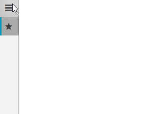

# Customize the Open/Close Animations of the NavigationPane

__RadNavigationView__ provides built in animations for opening and closing the NavigationPane. This article will demonstrate how you can customize these animations. 

## RadNavigationView Animations

By default __RadNavigationView__ defines three animations named __ResizePaneAnimation__, __MinimalPaneOpenAnimation__ and __MinimalPaneCloseAnimation__. __Example 1__ demonstrates the default values of these animations.

* __ResizePaneAnimation__: Played when the [DisplayMode]() of the RadNavigationView is either __Compact__ or __Expanded__ and the NavigationPane is opened or closed.
* __MinimalPaneOpenAnimation__: Played when the [DisplayMode]() of the RadNavigationView is __Minimal__ and the NavigationPane is closed.
* __MinimalPaneCloseAnimation__: Played when the [DisplayMode]() of the RadNavigationView is __Minimal__ and the NavigationPane is opened.

__Example 1: RadNavigationView Animations Default Values__
```XAML
    <animation:ResizeAnimation AnimationName="ResizePaneAnimation" TargetElementName="PART_PaneRoot" Duration="0:0:0.2" ResizeMode="Horizontal">
        <animation:ResizeAnimation.Easing>
            <ExponentialEase EasingMode="EaseOut" />
        </animation:ResizeAnimation.Easing>
    </animation:ResizeAnimation>
    <animation:SlideAnimation AnimationName="MinimalPaneOpenAnimation" TargetElementName="PART_PaneRoot" Duration="0:0:0.2" PixelsToAnimate="250" Orientation="Horizontal" Direction="In" />
    <animation:SlideAnimation AnimationName="MinimalPaneCloseAnimation" TargetElementName="PART_PaneRoot" Duration="0:0:0.2" PixelsToAnimate="250" Orientation="Horizontal" Direction="Out"/>
```

## Customizing Animations

In order to customize the animations supported by RadNavigationView, you can [extract its style](#extracting-control-templates-manually-from-the-theme-xaml-file) and modify it. This way you can customize the duration of the animations, change their easing function or replace the animation with a different one. __Example 2__ demonstrates how you can change the duration of the __ResizePaneAnimation__ from 0.2 seconds to 3 seconds.

__Example 2: Changing the duration of the ResizePaneAnimation__
```XAML
    <Window.Resources>
        <!-- If you are using the NoXaml binaries, you will have to base the style on the default one for the theme like so:
        <Style TargetType="telerik:RadNavigationView" BasedOn="{StaticResource RadNavigationViewStyle}">-->

        <Style TargetType="telerik:RadNavigationView">
            <Setter Property="animation:AnimationManager.AnimationSelector">
                <Setter.Value>
                    <animation:AnimationSelector>
                        <animation:ResizeAnimation AnimationName="ResizePaneAnimation" TargetElementName="PART_PaneRoot" Duration="0:0:3" ResizeMode="Horizontal">
                            <animation:ResizeAnimation.Easing>
                                <ExponentialEase EasingMode="EaseOut" />
                            </animation:ResizeAnimation.Easing>
                        </animation:ResizeAnimation>
                        <animation:SlideAnimation AnimationName="MinimalPaneOpenAnimation" TargetElementName="PART_PaneRoot" Duration="0:0:0.2" PixelsToAnimate="250" Orientation="Horizontal" Direction="In" />
                        <animation:SlideAnimation AnimationName="MinimalPaneCloseAnimation" TargetElementName="PART_PaneRoot" Duration="0:0:0.2" PixelsToAnimate="250" Orientation="Horizontal" Direction="Out"/>
                    </animation:AnimationSelector>
                </Setter.Value>
            </Setter>
        </Style>
    </Window.Resources>
    <Grid>
        <telerik:RadNavigationView PaneHeader="My Header">
            <telerik:RadNavigationView.Items>
                <telerik:RadNavigationViewItem Content="Bookmarks">
                    <telerik:RadNavigationViewItem.Icon>
                        <telerik:RadGlyph Glyph="&#xe303;" FontSize="16"/>
                    </telerik:RadNavigationViewItem.Icon>
                </telerik:RadNavigationViewItem>
            </telerik:RadNavigationView.Items>
        </telerik:RadNavigationView>
    </Grid>
```

#### __Figure 1: Result from Example 2 in the Office2016 theme__


> In order for the animations to be played correctly the __AnimationName__ and __TargetElementName__ properties should not be modified.

>tip The animation namespace used in __Example 2__ corresponds to the following: xmlns:animation="clr-namespace:Telerik.Windows.Controls.Animation;assembly=Telerik.Windows.Controls".

## See Also

 * [Getting Started]()
 * [Selection]()
 * [DataBinding]()
