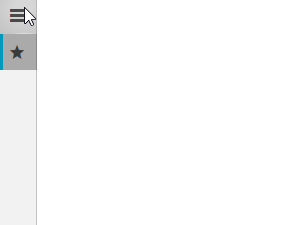

# Customize the Open/Close Animations of the NavigationPane

__RadNavigationView__ provides built in animations for opening and closing the NavigationPane. This article will demonstrate how you can customize these animations. 

## RadNavigationView Animations

By default __RadNavigationView__ defines three animations named __ResizePaneAnimation__, __MinimalPaneOpenAnimation__ and __MinimalPaneCloseAnimation__. __Example 1__ demonstrates the default values of these animations.

* __ResizePaneAnimation__: Played when the [DisplayMode]() of the RadNavigationView is either __Compact__ or __Expanded__ and the NavigationPane is opened or closed.
* __MinimalPaneOpenAnimation__: Played when the [DisplayMode]() of the RadNavigationView is __Minimal__ and the NavigationPane is closed.
* __MinimalPaneCloseAnimation__: Played when the [DisplayMode]() of the RadNavigationView is __Minimal__ and the NavigationPane is opened.

__Example 1: RadNavigationView Animations Default Values__
<snippet id='radnavigationview-how-to-customize-open-close-animations-block_1-xaml' />

## Customizing Animations

In order to customize the animations supported by RadNavigationView, you can [extract its style](#extracting-control-templates-manually-from-the-theme-xaml-file) and modify it. This way you can customize the duration of the animations, change their easing function or replace the animation with a different one. __Example 2__ demonstrates how you can change the duration of the __ResizePaneAnimation__ from 0.2 seconds to 3 seconds.

__Example 2: Changing the duration of the ResizePaneAnimation__
<snippet id='radnavigationview-how-to-customize-open-close-animations-block_2-xaml' />

#### __Figure 1: Result from Example 2 in the Office2016 theme__

> In order for the animations to be played correctly the __AnimationName__ and __TargetElementName__ properties should not be modified.

>tip The animation namespace used in __Example 2__ corresponds to the following: xmlns:animation="clr-namespace:Telerik.Windows.Controls.Animation;assembly=Telerik.Windows.Controls".

## See Also

 * [Getting Started]()
 * [Selection]()
 * [DataBinding]()