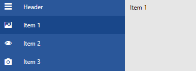

# Data Binding

__RadNavigationView__ can be bound to a collection of objects through its ItemsSource property. This article will demonstrate how to data bind a collection of custom objects to RadNavigationView.

>Note that for every business object from the data bound collection, RadNavigationView will generate a RadNavigationViewItem container representing this object.

## Creating the Model and View Model

For the purposes of this article, we will create a simple object and a view model which will hold a collection of our models. The IconGlyph property of the NavigationItemModel holds the string which will be set to the Icon property of the RadNavigationViewItem. For more information about it, check out the [Icon and IconTemplate](#radnavigationviewitem-icontemplate) article in our documentation.

__Example 1: Creating the model and viewmodel__
```C#
    public class NavigationItemModel
    {
        public string Title { get; set; }
        public string IconGlyph { get; set; }
    }

    public class MainViewModel
    {
        private readonly string[] glyphStrings = new string[] { "&#xe501;", "&#xe13d;", "&#xe500;" };

        public ObservableCollection<NavigationItemModel> Items { get; set; }
       

        public MainViewModel()
        {
            this.Items = new ObservableCollection<NavigationItemModel>();

            for (int i = 1; i <= 3; i++)
            {
                var glyphString = this.glyphStrings[i - 1];
                this.Items.Add(new NavigationItemModel() {Title = "Item " + i, IconGlyph = glyphString });
            }
        }
    }
```
```VB.NET
    Public Class NavigationItemModel
		Public Property Title() As String
		Public Property IconGlyph() As String
    End Class

    Public Class MainViewModel
		Private ReadOnly glyphStrings() As String = { "&#xe501;", "&#xe13d;", "&#xe500;" }

		Public Property Items() As ObservableCollection(Of NavigationItemModel)


		Public Sub New()
			Me.Items = New ObservableCollection(Of NavigationItemModel)()

			For i As Integer = 1 To 3
				Dim glyphString = Me.glyphStrings(i - 1)
				Me.Items.Add(New NavigationItemModel() With {
					.Title = "Item " & i,
					.IconGlyph = glyphString
				})
			Next i
		End Sub
    End Class
```


## Defining the RadNavigationView

After we have created the viewmodel, the next step is to create an instance and set it to the DataContext of a RadNavigationView. This is demonstrated in __Example 2__. Note, that the change of the RadNavigationView Content is animated by a [RadTransitionControl](), which is bound to its SelectedItem. Additionally, a ContentTemplate is specified for the RadTransitionControl.

__Example 2: Defining the control and the necessary styles__
```XAML
    <Window.Resources>

        <local:MainViewModel x:Key="ViewModel" />
        <telerik:StringToGlyphConverter x:Key="StringToGlyphConverter" />

        <!-- If you are using the NoXaml binaries, you will have to base the style on the default one for the theme like so:
        <Style TargetType="telerik:RadNavigationViewItem" BasedOn="{StaticResource RadNavigationViewItemStyle}">-->
        
        <Style TargetType="telerik:RadNavigationViewItem" >
            <Setter Property="Content" Value="{Binding Title}" />
            <Setter Property="Icon" Value="{Binding IconGlyph}" />
            <Setter Property="IconTemplate">
                <Setter.Value>
                    <DataTemplate>
                        <telerik:RadGlyph Glyph="{Binding Converter={StaticResource StringToGlyphConverter}}" />
                    </DataTemplate>
                </Setter.Value>
            </Setter>
        </Style>

         <DataTemplate x:Key="TransitionControlContentTemplate">
            <TextBlock Margin="10" Text="{Binding Title}" />
        </DataTemplate>
    </Window.Resources>

    <Grid>
        <telerik:RadNavigationView DataContext="{StaticResource ViewModel}"  ItemsSource="{Binding Items}" PaneHeader="Header">
            <telerik:RadNavigationView.Content>
                <telerik:RadTransitionControl Content="{Binding SelectedItem, RelativeSource={RelativeSource AncestorType=telerik:RadNavigationView}}" ContentTemplate="{StaticResource TransitionControlContentTemplate}" Foreground="Black" Duration="0:0:0.4">
                    <telerik:RadTransitionControl.Transition>
                        <telerik:FadeTransition />
                    </telerik:RadTransitionControl.Transition> 
                </telerik:RadTransitionControl>
            </telerik:RadNavigationView.Content>
        </telerik:RadNavigationView>
    </Grid>
```

#### __Figure 1: Result from Example 2 in the Office2016 theme__


>For another, more complicated, databinding example, check out the __First Look__ RadNavigationView example from the [WPF Controls Samples application](https://demos.telerik.com/wpf/).

## See Also 
* [Getting Started]()
* [Display Mode]()