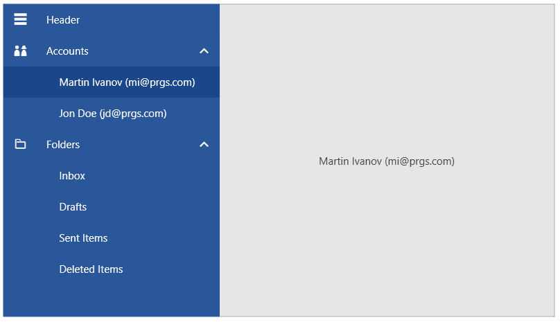

# Hierarchical Data Binding

This article shows how to data bind hierarchical data to RadNavigationView.

The control can be populated with business objects via its __ItemsSource__ property. Then the __DisplayMemberPath__ and __ItemContainerStyle__ properties can be used to further customize the items and allow sub-items.

## Defining the Model

The following model is defining a string property to serve as the content of the items and a collection for the child data items. An additional string property is used for the icon [glyph]().

__Example 1: Creating the model__
<snippet id='radnavigationview-populating-with-data-hierarchical-databinding-block_1-cs' />

__Example 2: Populating the collection with data__
<snippet id='radnavigationview-populating-with-data-hierarchical-databinding-block_2-cs' />

## Defining the View

To assign the data collection to the RadNavigationView control, set its __ItemsSource__ property.

To data bind the content of the RadNavigationViewItem elements set the __DisplayMemberPath__ property of RadNavigationView. Alternatively, you can use the __ItemContainerStyle__ and set the __Content__ property of the RadNavigationViewItems.

To customize the appearance of the RadNavigationViewItems and also allow sub-items to be shown, use an implicit style. This allows to set the __ItemsSource__  and __DisplayMemberPath__ properties of the __RadNavigationViewItems__.

__Example 3: Setting up the view__
<snippet id='radnavigationview-populating-with-data-hierarchical-databinding-block_3-xaml' />

#### Figure 1: RadNavigationView with sub items

Note that for every business object from the data bound collection, RadNavigationView will generate a RadNavigationViewItem container representing this object.

## See Also 
* [Getting Started]()
* [Data Binding]()
* [Display Mode]()