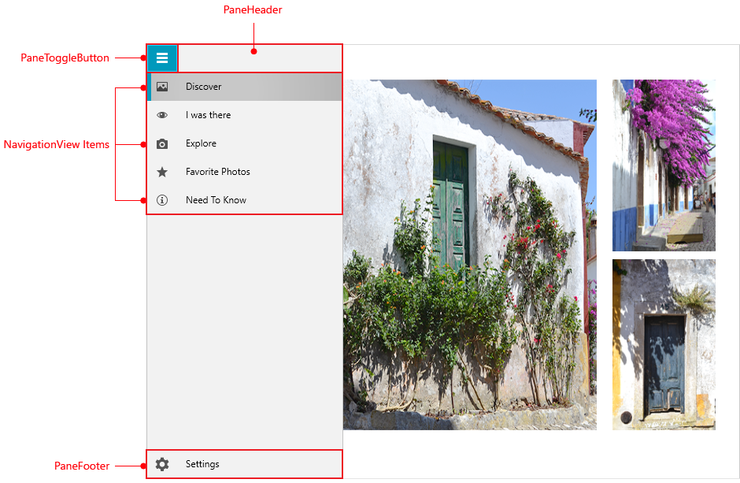

# {{ site.framework_name }} RadNavigationView Visual Structure

This topic defines terms and concepts related to __RadNavigationView__ that you have to get familiar with before you continue reading this help. __Figure 1__ demonstrates a __RadNavigationView__ with its NavigationPane opened and explanations of the visual elements .

#### __Figure 1: RadNavigationView in the Fluent theme__

The following table lists the elements that make up a RadNavigationView:

* __PaneHeader__: Represents the Header of a RadNavigationView. For more information, read the [Header and Footer](#customizing-the-header) article.

* __PaneToggleButton__: Opens/Closes the NavigationPane which hosts the RadNavigationViewItems.

* __NavigationView Items__: RadNavigationViewItems can be populated [statically](#populating-with-items) or through [databinding]().

* __Pane Footer__: Represents the Footer of a RadNavigationView. For more information, read the [Header and Footer](#customizing-the-footer) article.

## See Also

 * [Getting Started]()
