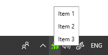

# ContextMenu

You can display a context menu when the user interacts with the notify icon with the help of the __TrayContextMenu__ property. 

## TrayContextMenu

The __TrayContextMenu__ property expects a value of type [RadContextMenu](). __Example 1__ demonstrates how it can be used. 

__Example 1: Setting TrayContextMenu__
```XAML
    
    <telerik:RadNotifyIcon
        x:Name="icon">
        <telerik:RadNotifyIcon.TrayContextMenu>
            <telerik:RadContextMenu IconColumnWidth="0">
                <telerik:RadMenuItem Header="Item 1" />
                <telerik:RadMenuItem Header="Item 2" />

                <telerik:RadMenuItem Header="Item 3" />
            </telerik:RadContextMenu>
        </telerik:RadNotifyIcon.TrayContextMenu>
    </telerik:RadNotifyIcon>
```

#### __Figure 1: RadContextMenu displayed over the icon__



## ContextMenuActivationMouseEvent

The __ContextMenuActivationMouseEvent__ property determines when the context menu will be shown. The default value is __RightClick__.

__Example 2: Setting ContextMenuActivationMouseEvent__
```XAML
    
    <telerik:RadNotifyIcon ContextMenuActivationMouseEvent="RightDoubleClick" />
```

## See Also 

* [Events]()
* [Tooltip]()
* [Popup]()
* [Balloon Notifications]()
