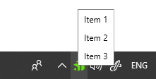

# ContextMenu

You can display a context menu when the user interacts with the notify icon with the help of the __TrayContextMenu__ property. 

## TrayContextMenu

The __TrayContextMenu__ property expects a value of type [RadContextMenu](). __Example 1__ demonstrates how it can be used. 

__Example 1: Setting TrayContextMenu__
<snippet id='radnotifyicon-features-contextmenu-block_1-xaml' />

#### __Figure 1: RadContextMenu displayed over the icon__

## ContextMenuActivationMouseEvent

The __ContextMenuActivationMouseEvent__ property determines when the context menu will be shown. The default value is __RightClick__.

__Example 2: Setting ContextMenuActivationMouseEvent__
<snippet id='radnotifyicon-features-contextmenu-block_2-xaml' />

## See Also 

* [Events]()
* [Tooltip]()
* [Popup]()
* [Balloon Notifications]()