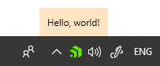

# Popup

The __RadNotifyIcon__ allows for displaying a popup upon interacting with the icon or by manually calling the exposed methods. 

## PopupContent and PopupContentTemplate

The __PopupContent__ and __PopupContentTemplate__ properties allow for setting the popup's content and changing its default look. Whatever is set to the __PopupContent__ will be the DataContext inside the __PopupContentTemplate__. __Example 1__ demonstrates how you can setup those properties. 

__Example 1: Setting PopupContent and PopupContentTemplate__
```XAML    
    <telerik:RadNotifyIcon
        x:Name="icon"
        PopupContent="Hello, world!"
        PopupActivationMouseEvent = "LeftClick">
        <telerik:RadNotifyIcon.PopupContentTemplate>
            <DataTemplate>
                <Border Background="Bisque">
                    <TextBlock Text="{Binding}" Padding="10"/>
                </Border>
            </DataTemplate>
        </telerik:RadNotifyIcon.PopupContentTemplate>
    </telerik:RadNotifyIcon>
```

#### __Figure 1: RadNotifyIcon with activated popup__



## PopupActivationMouseEvent

The __PopupActivationMouseEvent__ property determines when the popup will be shown. The default value is __LeftClick__.

__Example 2: Setting PopupActivationMouseEvent__
```XAML    
    <telerik:RadNotifyIcon PopupActivationMouseEvent="LeftDoubleClick" />
```

## PopupShowDuration

The __PopupShowDuration__ specifies the amount of time in __milliseconds__ after which the popup will begin to close automatically. The default value is __5000__ milliseconds (5s). 

__Example 3: Setting PopupShowDuration__
```XAML    
    <telerik:RadNotifyIcon PopupShowDuration="10000" />
```

## PopupCloseMode

The __PopupCloseMode__ is a bitwise enumeration, which controls the actions that will close the popup. The possible values are:

* **None**: The popup can only be closed in code (with the __HidePopup__ method) or by clicking on the notify icon. 
* **Deactivate**: The popup can be closed by clicking outside of it or by deactivating it with a windows keyboard shortcut.
* **Timeout**: The popup will be closed after the time specified by the __PopupShowDuration__ runs out. This is the default value.

__Example 4: Closing the popup on deactivation or timeout__
```XAML    
    <telerik:RadNotifyIcon PopupCloseMode="Deactivate, TimeOut"  />
```

## Programmatically Showing the Popup

The RadNotifyIcon allows for programmatically showing a popup through the __ShowPopup__ method. It exposes one overload, which provides the option of specifying a screen location. 

* **void ShowPopup()**: Shows the popup on top of the notify icon.
* **void ShowPopup(Point location)**: Shows the popup at the provided location.

    __Example 5: Using the ShowPopup method__
    ```C#

        this.icon.ShowPopup();
    ```
	```VB.NET

        Me.icon.ShowPopup()
    ```

## Programmatically Hiding the Popup

You can manually hide the popup with the __HidePopup__ method as shown in __Example 6__.

__Example 6: Using the HidePopup method__
```C#

    this.icon.HidePopup();
```
```VB.NET

    Me.icon.HidePopup()
```

## Popup animations

You can control the opening and closing animation with the __PopupShowAnimation__ and __PopupHideAnimation__ properties respectively. They expect an animation of type [RadAnimation](https://docs.telerik.com/devtools/wpf/api/telerik.windows.controls.animation.radanimation) and by default [FadeAnimations](https://docs.telerik.com/devtools/wpf/api/telerik.windows.controls.animation.fadeanimation) are used.

__Example 7: Setting PopupShowAnimation and PopupHideAnimation__
```XAML
    <Grid>
        <Grid.Resources>
            <telerik:ScaleAnimation x:Key="showAnimation" MinScale="0.1" MaxScale="0.9" Duration="00:00:02" />
            <telerik:ScaleAnimation x:Key="hideAnimation" MinScale="0.9" MaxScale="0.1" Duration="00:00:02" />
        </Grid.Resources>
        <telerik:RadNotifyIcon
            x:Name="icon"
            PopupContent="Hello, world!"
            PopupActivationMouseEvent = "LeftDoubleClick"
            PopupShowAnimation="{StaticResource showAnimation}"
            PopupHideAnimation="{StaticResource hideAnimation}">
            <telerik:RadNotifyIcon.PopupContentTemplate>
                <DataTemplate>
                    <Border Background="Bisque">
                        <TextBlock Text="{Binding}" Padding="10"/>
                    </Border>
                </DataTemplate>
            </telerik:RadNotifyIcon.PopupContentTemplate>
        </telerik:RadNotifyIcon>
    </Grid>
```

## IsPopupOpen

The __IsPopupOpen__ property allows you to check whether a popup is currently open.

__Example 8: Using IsPopupOpen__
```C#
    var isOpen = this.icon.IsPopupOpen;
```
```VB.NET
    Dim isOpen = Me.icon.IsPopupOpen
```

## See Also 

* [Events]()
* [Tooltip]()
* [ContextMenu]()
* [Balloon Notifications]()