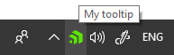
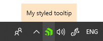

# Tooltip

You can configure the tooltip that is displayed when the user hovers over the icon with the __TooltipContent__ property. By default a styled custom tooltip is shown. If you want to show the native tooltip, set the **UseNativeTooltip** property to **True**.

## Native ToolTip

To display a native tooltip, set the __UseNativeTooltip__ property as demonstrated in __Example 1__. When this property is **True** the ToString() value of the **TooltipContent** will be shown in the tooltip.

__Example 1: Setting TooltipContent__
```XAML
    
    <telerik:RadNotifyIcon
            x:Name="icon"
            TooltipContent="My tooltip"
            UseNativeTooltip="True">
    </telerik:RadNotifyIcon>
```

#### __Figure 1: RadNotifyIcon with tooltip__



> In order for theming to be applied, you can ommit the setting of the **UseNativeTooltip** property.

## TooltipContent and TooltipContentTemplate

The RadNotifyIcon provides a default TooltipContentTemplate that will be styled according to your theme. You can also customize it as per your requirements. The DataContext inside the __TooltipContentTemplate__ property will be whatever is set to the __TooltipContent__. 

__Example 2: Setting TooltipContent and TooltipContentTemplate__
```XAML
    
    <telerik:RadNotifyIcon
        x:Name="icon"
        TooltipContent="My styled tooltip">
        <telerik:RadNotifyIcon.TooltipContentTemplate>
            <DataTemplate>
                <Border Background="Bisque">
                    <TextBlock Text="{Binding}" Padding="10"/>
                </Border>
            </DataTemplate>
        </telerik:RadNotifyIcon.TooltipContentTemplate>
    </telerik:RadNotifyIcon>
```

#### __Figure 2: RadNotifyIcon with customized tooltip__



## IsTooltipOpen

The __IsTooltipOpen__ property allows you to check whether a styled tooltip is currently open. 

__Example 3: Using the IsTooltipOpen property__
```C#

    var isOpen = this.icon.IsTooltipOpen;
```
```VB.NET

    Dim isOpen = Me.icon.IsTooltipOpen
```

## See Also 

* [Events]()
* [Popup]()
* [ContextMenu]()
* [Balloon Notifications]()
