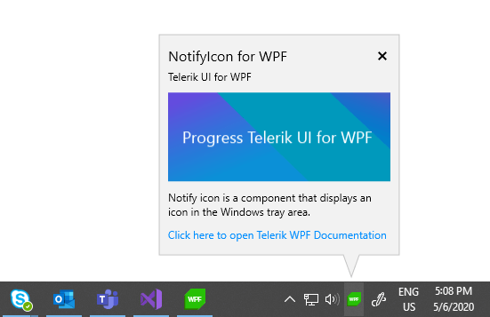

# Overview

Thank you for choosing __RadNotifyIcon__!			

__RadNotifyIcon__ is a control that can be used to display an icon in the Windows taskbar notification area. The icon can then respond to user interaction as well as display tooltips, popups and balloon notifications.

## Key Features

* Add an icon in the Windows taskbar notification area. Learn more in the [Getting Started]() article. 

* __Popup__: Display a popup upon user interaction with the icon or by manually calling the exposed methods. Learn more in the [Popup]() article. 

* __ContextMenu__: Show a popup to present the user with some options. Learn more in the [ContextMenu]() article. 

* __Tooltip__: Display a tooltip when the icon is hovered and customize it. Check out the [Tooltip]() article for more information. 

* __Balloon Notifications__: Show a notification to grab the user's attention. Check out the [Balloon Notifications]() article for more information. 

>tip Get started with the control with its [Getting Started]() help article that shows how to use it in a basic scenario.

>Check out the online demos at [demos.telerik.com](https://demos.telerik.com/wpf/).

## See Also

* [Getting Started]()
* [Events]()
