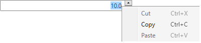

# Key Properties

__RadNumericUpDown__ comes with a couple of key properties which you can use to customize its default behavior.

* __Maximum__: The maximum possible value of RadNumericUpDown.

* __Minimum__: The minimum possible value of RadNumericUpDown.

* __SmallChange__: The change used by the Up and Down keys as well as the increase and decrease repeat buttons of RadNumericUpDown. For more information see the [Keyboard Support]() article.

* __LargeChange__: The change used by the PageUp and PageDown keys. For more information see the [Keyboard Support]() article.

* __AutoReverse__: Determines whether the control will start from the Minimum value whenever the Maximum is reached and vice versa.

* __ChangeAcceleration__: Whenever any of the PageUp, PageDown, Up, and Down buttons are held for more than 20 clicks, the repeat interval will automatically start to decrease.

* __IsEditable__: Determines whether the user can input numeric data in the TextBox using the keyboard. In both cases, the value could be changed using the increase and decrease repeat buttons and the Up and Down keys.

* __UpdateValueToMatchTextOnLostFocus__: Determines whether the selected __Value__ will be updated to match the displayed text when the focus gets lost and the text gets formatted. (available with **SP1 Q2 2015**) 

* __IsReadOnly__: Determines whether the editing functionality of the control is enabled or disabled. When it is set to True both the increase and decrease repeat buttons are disabled – the user can no longer press them in order to increase/decrease the value. The __TextBox__ that contains the __ContentText__ becomes read-only as well and the value can no longer be changed using the keyboard or the Up/Down keys.

* __NullValue__: Gets or sets the string that is displayed when the Value of the control is null.

* __UpdateValueEvent__: Gets or sets the way the Value property is updated. When set to **PropertyChanged**, the Value property will be changed immediately after the user input and when **LostFocus** is selected the value will be changed when the focus leaves the control.

* __CustomUnit__: Gets or sets an additional string to appear in the end of numeric values. For example, **kg**, **km/h**, etc.

* __IsInteger__: Gets or sets a value indicating whether the format is integer. The expected value is of type __bool__.

**Example 1** demonstrates how to set the **IsReadOnly** property of the control.

__Example 1: Make RadNumericUpDown read-only__

```XAML
	<telerik:RadNumericUpDown x:Name="radNumericUpDown" IsReadOnly="True"/>
```

#### Figure 1: A read-only RadNumericUpDown


As the TextBox becomes read-only as well the value of the control could no longer be changed, but still it could be selected and copied.

#### Figure 2: Select the value of а read-only RadNumericUpDown



## See Also

* [Keyboard Support]()
* [Events]()
