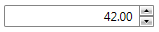
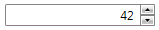

# Formatting

This article will explain in details the different formatting option of __RadNumericUpDown__.

## Using ValueFormat      

RadNumericUpDown has the ability to format its value in three different formats specified by the __ValueFormat__ property.

Here is a brief description of each value in the ValueFormat enumerator property.

* __Numeric__ - used for numeric values without specific formatting, the default value is taken from the current culture of Windows. The specific Numeric format is described by all members of __NumberFormatInfo__ starting with __Numeric__ prefix.

* __Currency -__ used for currency values, the default currency formatting is taken from the current culture of Windows. The specific Currency format is described by all members of __NumberFormatInfo__ starting with __Currency__ prefix.

* __Percentage__ - used for percentage values, the default percentage value is taken from the current culture of Windows. The specific Percentage format is described by all members of __NumberFormatInfo__ starting with __Percentage__ prefix.

The following examples shows how to use ValueFormat and __NumberFormatInfo__ properties to achieve the deserved format:        

* __ValueFormat set to Numeric__

<snippet id='radnumericupdown-features-formatting-block_1-cs' />
<snippet id='radnumericupdown-features-formatting-block_1-vb' />

<snippet id='radnumericupdown-features-formatting-block_2-xaml' />

* __ValueFormat set to Currency__

<snippet id='radnumericupdown-features-formatting-block_3-cs' />
<snippet id='radnumericupdown-features-formatting-block_3-vb' />

<snippet id='radnumericupdown-features-formatting-block_4-xaml' />

* __ValueFormat set to Percentage__

<snippet id='radnumericupdown-features-formatting-block_5-cs' />
<snippet id='radnumericupdown-features-formatting-block_5-vb' />

<snippet id='radnumericupdown-features-formatting-block_6-xaml' />

For custom formatting __RadNumericUpDown__ exposes additional property that is only used with the __Numeric__ value of __ValueFormat__. __CustomUnit__ is used to customize your formatting in case all the others type of formatting don't meet your needs.

Here is a simple example of how to use __CustomUnit__ property:        

<snippet id='radnumericupdown-features-formatting-block_7-cs' />
<snippet id='radnumericupdown-features-formatting-block_7-vb' />

## Using CustomUnit      

By design when the __ValueFormat__ property of the RadNumericUpDown control is set to __Percentage__ the input is parsed as follows:
        
Input	|	Parsed value
---	|	---
1	|	100.00%
45	|	4 500,00 %

The above parsing is correct and useful when using the value of the RadNumericUpDown to solve percentage of other values. In many other cases the desired parsing would be to show the input value directly as percentages. Meaning that entering 1 would lead to 1% not 100%. In order to achieve this parsing all that is needed is to set the __Minimum__, __Maximum__ and __CustomUnit__ properties of the control as follows:
        

<snippet id='radnumericupdown-features-formatting-block_8-xaml' />

The next table show examples of the input parsing when setting the above properties:
       
Input	|	Parsed value
---	|	---
1	|	1.00%
45	|	45,00 %

>When using the described approach and want to solve the percentages of other values using the value of the RadNumericUpDown make sure to divide it by 100 first.

## Hide Trailing Zeros    

__RadNumericUpDown__ provides property named __HideTrailingZeros__ which removes the digits after the decimal separator when they are all zeros. For example if you have the following __RadNumericUpDown__ with two decimal digits and value set to 42:        

<snippet id='radnumericupdown-features-formatting-block_9-xaml' />

It will look the following way:

If you set the __HideTrailingZeros__ property to True as shown below:       

<snippet id='radnumericupdown-features-formatting-block_10-xaml' />

This will be result:

>The default value of the property is __False__ - if there are trailing zeros they would be visible.         