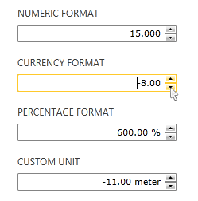

# Overview



__RadNumericUpDown__ provides a rich user experience by allowing users to define various value formats, as well as additionally customize them to meet the customers' business requirements. Besides the predefined numeric, percentage and currency formats, developers can also create their custom formats. Additionally, the control allows you to define minimum and maximum values to which the user can increment/decrement the input’s value. 

## Key Features

* __Formatting options__: You can set different formatting options to be applied over the control's value. Read more about this in the [Formatting]() article.

* __Keyboard and mouse support__: The control supports updating the value via the keyboard and the mouse. You can do that with the mouse wheel or the up/down and page up/down keys. Read more about this in the [Keyboard Support]() article.

* __Different display modes__: RadNumericUpDown allows you to change between two display modes. The default one is the up-down mode that shows a textbox input and paired arrow buttons next to it. And the other one displays only the arrow buttons. You can switch between the modes via the __ShowTextBox__ boolean property.

* __Custom value change step__: The control allows you to define the value step that will be applied to the value upon each increase/decrease. Read more about this in the [Behavior]() article.

* __Read-only mode__: RadNumericUpDown supports read-only mode in which the end user cannot set custom values.

>tip Get started with the control with its [Getting Started]() help article that shows how to use it in a basic scenario.

> Check out the demos at [demos.telerik.com](https://demos.telerik.com/silverlight/#NumericUpDown)[demos.telerik.com](https://demos.telerik.com/wpf/)

## See Also  
 * [Visual Structure]()
 * [Behavior]()
 