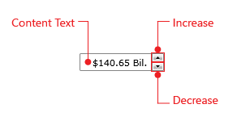

# Structure

This section defines terms and concepts used in the scope of __RadNumericUpDown__ you have to get familiar with prior to continue reading this help. They can also be helpful when contacting our support service in order to describe your issue better. For more detailed descriptions of the required parts of the control please visit the [Required Parts]() section. 

* __ContentText__ - returns the string representation of the RadNumericUpDown' value along with the complete formatting defined by __NumericUnit, ValueFormat__ and __NumberFormatInfo__ properties.

* __Increase -__ a repeat button used to increment the value by the current value of __SmallChange__ property.

* __Decrease -__ a repeat button used to decrement the value by the current value of __SmallChange__ property.
