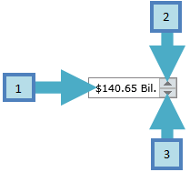

# Required parts

In order to customize the control template of RadNumericUpDown, you should get familiar with the required template parts that have specific name. This is required from the code-behind implementation of __RadNumericUpDown__ and if you don’t use all of these controls with the same names, __RadNumericUpDown__ will not have complete functionality. Note that your control will still build and you will not receive any notifications for missing parts.

Here is an image that describes the required items from the code-behind:

#### __XAML__

{{region xaml-radnumericupdown-required-parts_0}}
	<!--1. Textbox control for text input-->
	<TextBox x:Name="textbox" />
	<!--2. Button control for increasing the value-->
	<RepeatButton x:Name="increase" />
	<!--3. Button control for decreasing the value-->
	<RepeatButton x:Name="decrease" />
{{endregion}}
