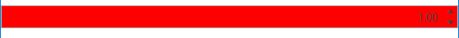

# Styling the RadNumericUpDown

This article will demonstrate how to create a Style targeting the __RadNumericUpDown__ control.

## Targeting the RadNumericUpDown Element

In order to style the RadNumericUpDown, you can create a Style targeting __RadNumericUpDown__.

__Example 1: Creating a style targeting the RadNumericUpDown control__

```XAML
	<StackPanel>
        <StackPanel.Resources>
            <!-- If you are using the NoXaml binaries, you should base the style on the default one like so:-->
            <!--<Style TargetType="telerik:RadNumericUpDown" BasedOn="{StaticResource RadNumericUpDownStyle}">-->

            <Style TargetType="telerik:RadNumericUpDown">
                <Setter Property="Background" Value="Red" />
            </Style>
        </StackPanel.Resources>
        <telerik:RadNumericUpDown Value="1" />
    </StackPanel>
```

#### __Figure 1: RadNumericUpDown with custom style in the Office2016 theme__


>tip In order to learn how to further modify the control by extracting its ControlTemplate, read the [Editing Control Templates]() article.
