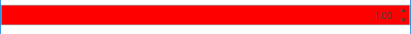

# Styling the RadNumericUpDown

This article will demonstrate how to create a Style targeting the __RadNumericUpDown__ control.

## Targeting the RadNumericUpDown Element

In order to style the RadNumericUpDown, you can create a Style targeting __RadNumericUpDown__.

__Example 1: Creating a style targeting the RadNumericUpDown control__

<snippet id='radnumericupdown-styles-and-templates-styling-the-radnumericupdown-block_1-xaml' />

#### __Figure 1: RadNumericUpDown with custom style in the Office2016 theme__

>tip In order to learn how to further modify the control by extracting its ControlTemplate, read the [Editing Control Templates]() article.