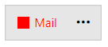
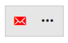
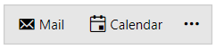

# Custom Content

## ContentTemplate and CompactContentTemplate

Each RadOfficeNavigationBarItem supports setting complex structures of elements to its `ContentTemplate` and `CompactContentTemplate` properties. These structures will represent the values set to its `Content` and `CompactContent` properties. 

>important The CompactContent, CompactContentTemplate, and CompactContentTemplateSelector properties will be used when the `IsInCompactMode` property is set to __True__. To learn more about this items display mode, check the [Display Modes]() article.

__Example complex ContentTemplate__
```XAML
    <telerik:RadOfficeNavigationBarItem Content="Mail">
        <telerik:RadOfficeNavigationBarItem.ContentTemplate>
            <DataTemplate>
                <StackPanel Orientation="Horizontal">
                    <Border Width="12" Height="12" Background="Red"/>
                    <TextBlock Text="{Binding}" Foreground="Red" Margin="5 0 0 0"/>
                </StackPanel>
            </DataTemplate>
        </telerik:RadOfficeNavigationBarItem.ContentTemplate>
    </telerik:RadOfficeNavigationBarItem>
```

__RadOfficeNavigationBarItem with a custom ContentTemplate__



__Example complex CompactContentTemplate__
```XAML
    <telerik:RadOfficeNavigationBar IsInCompactMode="True">
        <telerik:RadOfficeNavigationBarItem CompactContent="&#xe809;">
            <telerik:RadOfficeNavigationBarItem.CompactContentTemplate>
                <DataTemplate>
                    <telerik:RadGlyph Glyph="{Binding}" Foreground="Red"/>
                </DataTemplate>
            </telerik:RadOfficeNavigationBarItem.CompactContentTemplate>
        </telerik:RadOfficeNavigationBarItem>
    </telerik:RadOfficeNavigationBar>
```

__RadOfficeNavigationBarItem with a custom CompactContentTemplate__



## ContentTemplateSelector and CompactContentTemplateSelector

The ContentTemplateSelector and CompactContentTemplateSelector allow you to apply different data templates based on custom logic.

For the purpose of the following example, the `ContentTemplateSelector` property of the RadOfficeNavigationBarItem will be used.

>important The example utilizes the RadGlyph element. To learn more about it, check the [RadGlyph]() article.

Define a sample model class that will hold the name and the glyph as string of each item.

__Define a model__
```C#
    public class ItemModel
    {
        public string Name { get; set; }
        public string GlyphString { get; set; }
    }
```
```VB.NET
    Public Class ItemModel
        Public Property Name As String
        Public Property GlyphString As String
    End Class
```

After that, create a view model that will contain a collection of ItemModels instances. This collection will be bound to the `ItemsSource` property of the `RadOfficeNavigationBar` control.

__Define a view model__
```C#
    public class ItemsViewModel
    {
        public ItemsViewModel()
        {
            this.ItemModels = new ObservableCollection<ItemModel>
            {
                new ItemModel() { Name = "Mail", GlyphString = "xe809" },
                new ItemModel() { Name = "Calendar", GlyphString = "No glyph" },
            };
        }

        public ObservableCollection<ItemModel> ItemModels { get; set; }
    }
```
```VB.NET
    Public Class ItemsViewModel
    Public Sub New()
    ItemModels = New ObservableCollection(Of ItemModel) From {
      New ItemModel() With {
          .Name = "Mail",
            .GlyphString = "xe809"
        },
        New ItemModel() With {
          .Name = "Calendar",
            .GlyphString = "No glyph"
        }
    }
    End Sub

    Public Property ItemModels As ObservableCollection(Of ItemModel)
    End Class
```

Next, we can define a custom `DataTemplateSelector` class and override its `SelectTemplate` method. In it, we will check if the GlyphString property equals __"No glyph"__ and return different `DataTemplate` depending on this check.

__Define a custom DataTemplateSelector__
```C#
    public class GlyphContentTemplateSelector : DataTemplateSelector
    {
        public DataTemplate GlyphDataTemplate { get; set; }
        public DataTemplate DefaultDataTemplate { get; set; }

        public override DataTemplate SelectTemplate(object item, DependencyObject container)
        {
            ItemModel itemModel = (ItemModel)item;

            if (itemModel.GlyphString == "No glyph")
            {
                return this.DefaultDataTemplate;
            }

            return this.GlyphDataTemplate;
        }
    }
```
```VB.NET
    Public Class GlyphContentTemplateSelector
        Inherits DataTemplateSelector
        Public Property GlyphDataTemplate As DataTemplate
        Public Property DefaultDataTemplate As DataTemplate

        Public Overrides Function SelectTemplate(ByVal item As Object, ByVal container As DependencyObject) As DataTemplate
            Dim itemModel As ItemModel = CType(item, ItemModel)

            If itemModel.GlyphString Is "No glyph" Then
                Return DefaultDataTemplate
            End If

            Return GlyphDataTemplate
        End Function
    End Class
```

Create an instance of the custom DataTemplateSelector class in XAML and set it to each RadOfficeNavigationBarItem element.

__Instantiate the custom DataTemplateSelector in XAML__
```XAML
    <Application.Resources>
        <telerik:StringToGlyphConverter x:Key="StringToGlyphConverter"/>

        <local:GlyphContentTemplateSelector x:Key="GlyphContentTemplateSelector">
            <local:GlyphContentTemplateSelector.DefaultDataTemplate>
                <DataTemplate>
                    <StackPanel Orientation="Horizontal">
                        <telerik:RadGlyph Glyph="{StaticResource GlyphCalendar}" Margin="0 0 3 0"/>
                        <TextBlock Text="{Binding Name}"/>
                    </StackPanel>
                </DataTemplate>
            </local:GlyphContentTemplateSelector.DefaultDataTemplate>
            <local:GlyphContentTemplateSelector.GlyphDataTemplate>
                <DataTemplate>
                    <StackPanel Orientation="Horizontal">
                        <telerik:RadGlyph Glyph="{Binding GlyphString, Converter={StaticResource StringToGlyphConverter}}" Margin="0 0 3 0"/>
                        <TextBlock Text="{Binding Name}"/>
                    </StackPanel>
                </DataTemplate>
            </local:GlyphContentTemplateSelector.GlyphDataTemplate>
        </local:GlyphContentTemplateSelector>

        <Style x:Key="OfficeNavigationBarItemStyle" TargetType="telerik:RadOfficeNavigationBarItem" BasedOn="{StaticResource RadOfficeNavigationBarItemStyle}">
            <Setter Property="ContentTemplateSelector" Value="{StaticResource GlyphContentTemplateSelector}"/>
        </Style>
    </Application.Resources>
```

Finally, apply the new Style to the `ItemContainerStyle` property of the RadOfficeNavigationBar control.

__Set the custom Style to the ItemContainerStyle property__
```XAML
    <Grid>
        <Grid.DataContext>
            <local:ItemsViewModel/>
        </Grid.DataContext>
        <telerik:RadOfficeNavigationBar ItemsSource="{Binding ItemModels}" ItemContainerStyle="{StaticResource OfficeNavigationBarItemStyle}"/>
    </Grid>
```

__RadOfficeNavigationBarItems with custom ContentTemplateSelector__



## See Also
* [Drag and Drop]()
* [Display Modes]()
* [Peek Popup]()