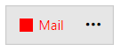
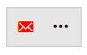
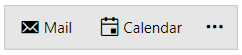

# Custom Content

## ContentTemplate and CompactContentTemplate

Each RadOfficeNavigationBarItem supports setting complex structures of elements to its `ContentTemplate` and `CompactContentTemplate` properties. These structures will represent the values set to its `Content` and `CompactContent` properties. 

>important The CompactContent, CompactContentTemplate, and CompactContentTemplateSelector properties will be used when the `IsInCompactMode` property is set to __True__. To learn more about this items display mode, check the [Display Modes]() article.

__Example complex ContentTemplate__
<snippet id='radofficenavigationbar-custom-content-block_1-xaml' />

__RadOfficeNavigationBarItem with a custom ContentTemplate__

__Example complex CompactContentTemplate__
<snippet id='radofficenavigationbar-custom-content-block_2-xaml' />

__RadOfficeNavigationBarItem with a custom CompactContentTemplate__

## ContentTemplateSelector and CompactContentTemplateSelector

The ContentTemplateSelector and CompactContentTemplateSelector allow you to apply different data templates based on custom logic.

For the purpose of the following example, the `ContentTemplateSelector` property of the RadOfficeNavigationBarItem will be used.

>important The example utilizes the RadGlyph element. To learn more about it, check the [RadGlyph]() article.

Define a sample model class that will hold the name and the glyph as string of each item.

__Define a model__
<snippet id='radofficenavigationbar-custom-content-block_3-cs' />
<snippet id='radofficenavigationbar-custom-content-block_3-vb' />

After that, create a view model that will contain a collection of ItemModels instances. This collection will be bound to the `ItemsSource` property of the `RadOfficeNavigationBar` control.

__Define a view model__
<snippet id='radofficenavigationbar-custom-content-block_4-cs' />
<snippet id='radofficenavigationbar-custom-content-block_4-vb' />

Next, we can define a custom `DataTemplateSelector` class and override its `SelectTemplate` method. In it, we will check if the GlyphString property equals __"No glyph"__ and return different `DataTemplate` depending on this check.

__Define a custom DataTemplateSelector__
<snippet id='radofficenavigationbar-custom-content-block_5-cs' />
<snippet id='radofficenavigationbar-custom-content-block_5-vb' />

Create an instance of the custom DataTemplateSelector class in XAML and set it to each RadOfficeNavigationBarItem element.

__Instantiate the custom DataTemplateSelector in XAML__
<snippet id='radofficenavigationbar-custom-content-block_6-xaml' />

Finally, apply the new Style to the `ItemContainerStyle` property of the RadOfficeNavigationBar control.

__Set the custom Style to the ItemContainerStyle property__
<snippet id='radofficenavigationbar-custom-content-block_7-xaml' />

__RadOfficeNavigationBarItems with custom ContentTemplateSelector__

## See Also
* [Drag and Drop]()
* [Display Modes]()
* [Peek Popup]()