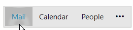

# Drag and Drop

`RadOfficeNavigationBar` provides you with the ability to reorder its items by dragging and dropping them at a desired position. By default, this functionality is disabled. To turn it on, set the `IsDragReorderEnabled` property of RadOfficeNavigationBar to __True__. Also, set the `DragDropManager.AllowCapturedDrag` attached property on each `RadOfficeNavigationBarItem` element.

__Enabling the drag and drop functionality__
```XAML
    <telerik:RadOfficeNavigationBar x:Name="radOfficeNavigationBar" IsDragReorderEnabled="True">
        <telerik:RadOfficeNavigationBar.ItemContainerStyle>
            <!--Set BasedOn property if NoXaml assemblies are used: BasedOn="{StaticResource RadOfficeNavigationBarItemStyle}"-->
            <Style TargetType="telerik:RadOfficeNavigationBarItem">
                <Setter Property="telerik:DragDropManager.AllowCapturedDrag" Value="True"/>
            </Style>
        </telerik:RadOfficeNavigationBar.ItemContainerStyle>
        <telerik:RadOfficeNavigationBar.Items>
            <telerik:RadOfficeNavigationBarItem Content="Mail"/>
            <telerik:RadOfficeNavigationBarItem Content="Calendar"/>
            <telerik:RadOfficeNavigationBarItem Content="People"/>
        </telerik:RadOfficeNavigationBar.Items>
    </telerik:RadOfficeNavigationBar>
```

__RadOfficeNavigationBar with enabled drag and drop functionality__



## See Also
* [Custom Content]()
* [Peek Popup]()
* [Display Modes]()
