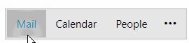

# Drag and Drop

`RadOfficeNavigationBar` provides you with the ability to reorder its items by dragging and dropping them at a desired position. By default, this functionality is disabled. To turn it on, set the `IsDragReorderEnabled` property of RadOfficeNavigationBar to __True__. Also, set the `DragDropManager.AllowCapturedDrag` attached property on each `RadOfficeNavigationBarItem` element.

__Enabling the drag and drop functionality__
<snippet id='radofficenavigationbar-drag-drop-block_1-xaml' />

__RadOfficeNavigationBar with enabled drag and drop functionality__

## See Also
* [Custom Content]()
* [Peek Popup]()
* [Display Modes]()