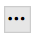
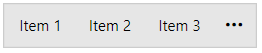
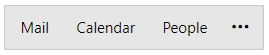
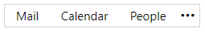

# Getting Started with {{ site.framework_name }} OfficeNavigationBar

This tutorial will walk you through the creation of a sample application that contains a `RadOfficeNavigationBar` control.

## Assembly References

To use RadOfficeNavigationBar, add references to the following assemblies:

* __Telerik.Licensing.Runtime__
* __Telerik.Windows.Controls__
* __Telerik.Windows.Controls.Navigation__

>tip With the 2025 Q1 release, the Telerik UI for WPF has a new licensing mechanism. You can learn more about it [here]().

### Adding Telerik Assemblies Using NuGet

To use __RadOfficeNavigationBar__ when working with NuGet packages, install the `Telerik.Windows.Controls.Navigation.for.Wpf.Xaml` package. The [package name may vary]() slightly based on the Telerik dlls set - [Xaml or NoXaml]()

Read more about NuGet installation in the [Installing UI for WPF from NuGet Package]() article.

## Defining the RadOfficeNavigationBar

You can add RadOfficeNavigationBar manually in XAML as demonstrated in the following example:

#### __[XAML] Adding RadOfficeNavigationBar in XAML__
{{region radofficenavigationbar-getting-started-0}}
    <telerik:RadOfficeNavigationBar/>
{{endregion}}

## Adding Items

The RadOfficeNavigationBar control works with `RadOfficeNavigationBarItem` elements that are added to the `Items` collection of the control. These elements can be added both in XAML and in code.

#### __[XAML] Adding RadOfficeNavigationBarItems in XAML__
{{region radofficenavigationbar-getting-started-1}}
    <telerik:RadOfficeNavigationBar>
        <telerik:RadOfficeNavigationBar.Items>
            <telerik:RadOfficeNavigationBarItem Content="Item 1"/>
            <telerik:RadOfficeNavigationBarItem Content="Item 2"/>
            <telerik:RadOfficeNavigationBarItem Content="Item 3"/>
        </telerik:RadOfficeNavigationBar.Items>
    </telerik:RadOfficeNavigationBar>
{{endregion}}

#### __[C#] Adding RadOfficeNavigationBarItems in code__
{{region radofficenavigationbar-getting-started-2}}
    RadOfficeNavigationBar radOfficeNavigationBar = new RadOfficeNavigationBar();

    radOfficeNavigationBar.Items.Add(new RadOfficeNavigationBarItem() { Content = "Item 1" });
    radOfficeNavigationBar.Items.Add(new RadOfficeNavigationBarItem() { Content = "Item 2" });
    radOfficeNavigationBar.Items.Add(new RadOfficeNavigationBarItem() { Content = "Item 3" });
{{endregion}}

#### __[VB.NET] Adding RadOfficeNavigationBarItems in code__
{{region radofficenavigationbar-getting-started-3}}
    Dim radOfficeNavigationBar As RadOfficeNavigationBar = New RadOfficeNavigationBar()

    radOfficeNavigationBar.Items.Add(New RadOfficeNavigationBarItem() With {
        .Content = "Item 1"
    })
    radOfficeNavigationBar.Items.Add(New RadOfficeNavigationBarItem() With {
        .Content = "Item 2"
    })
    radOfficeNavigationBar.Items.Add(New RadOfficeNavigationBarItem() With {
        .Content = "Item 3"
    })
{{endregion}}

__RadOfficeNavigationBar with several RadOfficeNavigationBarItems defined in its Items collection__

The `Content` property of the RadOfficeNavigationBarItem element is of type __object__ and it can contain values of any type. You can customize how the object is going to be visualized by creating a custom DataTemplate for the `ContentTemplate` property.

## Data Binding

RadOfficeNavigationBar allows you to data bind it to a collection of business objects. To do so, bind the collection to the `ItemsSource` property of the control.

The following example will demonstrate a simple data binding scenario.

#### __[C#] Simple business class__
{{region radofficenavigationbar-getting-started-4}}
    public class ItemModel
    {
        public string Name { get; set; }
    }
{{endregion}}

#### __[VB.NET] Simple business class__
{{region radofficenavigationbar-getting-started-5}}
    Public Class ItemModel
        Public Property Name As String
    End Class
{{endregion}}

Next, you can create a view model that will contain a collection of ItemModel objects.

#### __[C#] View model containing ObservableCollection of ItemModel objects__
{{region radofficenavigationbar-getting-started-6}}
    public class ItemsViewModel
    {
        public ItemsViewModel()
        {
            this.ItemModels = new ObservableCollection<ItemModel>
            {
                new ItemModel() { Name = "Mail" },
                new ItemModel() { Name = "Calendar" },
                new ItemModel() { Name = "People" }
            };
        }

        public ObservableCollection<ItemModel> ItemModels { get; set; }
    }
{{endregion}}

#### __[VB.NET] View model containing ObservableCollection of ItemModel objects__
{{region radofficenavigationbar-getting-started-7}}
    Public Class ItemsViewModel

    Public Sub New()
    ItemModels = New ObservableCollection(Of ItemModel) From {
      New ItemModel() With {
          .Name = "Mail"
        },
        New ItemModel() With {
          .Name = "Calendar"
        },
        New ItemModel() With {
          .Name = "People"
        }
    }
    End Sub

    Public Property ItemModels As ObservableCollection(Of ItemModel)
    End Class
{{endregion}}

Now that you have prepared the needed sample data, it is time to bind it to the RadOfficeNavigationBar. To do so, set its `ItemsSource` property to the collection of ItemModel objects. Additionally, you can set `DisplayMemberPath` property to mark which property of the business object will be used as its visual representation inside RadOfficeNavigationBar.

#### __[XAML] Binding the collection to the ItemsSource property__
{{region radofficenavigationbar-getting-started-8}}
    <Grid>
        <Grid.DataContext>
            <local:ItemsViewModel/>
        </Grid.DataContext>
        <telerik:RadOfficeNavigationBar ItemsSource="{Binding ItemModels}" DisplayMemberPath="Name"/>
    </Grid>
{{endregion}}

__RadOfficeNavigationBar with a collection bound to its ItemsSource property__

## Setting a Theme

The controls from our suite support different themes. You can see how to apply a theme different than the default one in the [Setting a Theme]() help article.

>important Changing the theme using implicit styles will affect all controls that have styles defined in the merged resource dictionaries. This is applicable only for the controls in the scope in which the resources are merged. 

* Choose between the themes and add reference to the corresponding theme assembly (ex: __Telerik.Windows.Themes.Windows8.dll__). You can see the different themes applied in the __Theming__ examples from our [WPF Controls Examples](https://demos.telerik.com/wpf/)[Silverlight Controls Examples](https://demos.telerik.com/silverlight/#PanelBar/Theming) application.

* Merge the ResourceDictionaries with the namespace required for the controls that you are using from the theme assembly. For the RadOfficeNavigationBar, you will need to merge the following resources:

	* __Telerik.Windows.Controls__
    * __Telerik.Windows.Controls.Navigation__

The following example demonstrates how to merge the ResourceDictionaries so that they are applied globally for the entire application.

#### __[XAML] Merge the ResourceDictionaries__
{{region radofficenavigationbar-getting-started-9}}
    <Application.Resources>
    	<ResourceDictionary>
    		<ResourceDictionary.MergedDictionaries>
    			<ResourceDictionary Source="/Telerik.Windows.Themes.Windows8;component/Themes/System.Windows.xaml"/>
    			<ResourceDictionary Source="/Telerik.Windows.Themes.Windows8;component/Themes/Telerik.Windows.Controls.xaml"/>
                <ResourceDictionary Source="/Telerik.Windows.Themes.Windows8;component/Themes/Telerik.Windows.Controls.Navigation.xaml"/>
    		</ResourceDictionary.MergedDictionaries>
    	</ResourceDictionary>
    </Application.Resources>
{{endregion}}

>Alternatively, you can use the theme of the control via the[StyleManager](https://docs.telerik.com/devtools/wpf/styling-and-appearance/stylemanager/common-styling-apperance-setting-theme-wpf).

The following image shows a RadOfficeNavigationBar with the __Windows8__ theme applied.

__RadOfficeNavigationBar with the Windows8 theme__


## Telerik UI for WPF Learning Resources

* [Telerik UI for WPF OfficeNavigationBar Component](https://www.telerik.com/products/wpf/officenavigationbar.aspx)
* [Getting Started with Telerik UI for WPF Components]()
* [Telerik UI for WPF Installation]()
* [Telerik UI for WPF and WinForms Integration]()
* [Telerik UI for WPF Visual Studio Templates]()
* [Setting a Theme with Telerik UI for WPF]()
* [Telerik UI for WPF Virtual Classroom (Training Courses for Registered Users)](https://learn.telerik.com/learn/course/external/view/elearning/16/telerik-ui-for-wpf) 
* [Telerik UI for WPF License Agreement](https://www.telerik.com/purchase/license-agreement/wpf-dlw-s)


## See Also
* [Custom Content]()
* [Drag and Drop]()
* [Navigation Options]()
* [Peek Popup]()
* [Display Modes]()
