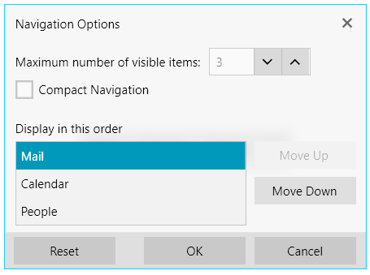

# Navigation Options

`RadOfficeNavigationBar` allows you to control the maximum number of visible items, their display order, as well as enabling/disabling the compact view mode. This is done by using the navigation options dialog. To display this window, select the options button that is displayed on the right of the RadOfficeNavigationBar items.

__Navigation options dialog__



## OfficeNavigationBarDialogViewModel

The RadOfficeNavigationBar controls exposes the `OfficeNavigationBarDialogViewModel` property. Using this property, you can control the behavior of the navigation options dialog via code. The property is of the type `OfficeNavigationBarDialogViewModel` and exposes the following properties:

* `MoveItemUpCommand`&mdash;Gets or sets a command that moves the SelectedItem object upwards in the OfficeNavigationBarDialogListBox.
* `MoveItemDownCommand`&mdash;Gets or sets a command that moves the SelectedItem object downwards in the OfficeNavigationBarDialogListBox.
* `IncreaseItemsMaxCountCommand`&mdash;Gets or sets a command that increases the maximum count of visible items.
* `DecreaseItemsMaxCountCommand`&mdash;Gets or sets a command that decreases the maximum count of visible items.
* `ResetCommand`&mdash;Gets or sets a command that resets the changes made in the navigation options dialog.
* `SelectedItem`&mdash;Gets or sets the SelectedItem of the OfficeNavigationBarDialogListBox.
* `ItemsMaxCount`&mdash;Gets or sets the current maximum items that will be displayed in the RadOfficeNavigationBar control.
* `IsInCompactMode`&mdash;Gets or sets a boolean value indicating whether the RadOfficeNavigationBar will be in Compact mode.
* `IsCompactModeCheckBoxVisible`&mdash;Gets or sets a boolean value indicating whether the CheckBox for switching to Compact mode will be visible.
* `Items`&mdash;Gets or sets the items displayed in the OfficeNavigationBarDialogListBox.

__Executing the Reset command__
```C#
    ICommand resetCommand = radOfficeNavigationBar.OfficeNavigationBarDialogViewModel.ResetCommand;
    resetCommand.Execute(null);
```
```VB.NET
    Dim resetCommand As ICommand = radOfficeNavigationBar.OfficeNavigationBarDialogViewModel.ResetCommand
    resetCommand.Execute(Nothing)
```

## See Also
* [Custom Content]()
* [Overflow Menu]()
* [Peek Popup]()