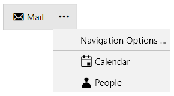

# Overflow Menu

When the number of the `RadNavigationBarItem` elements exceeds the count of the maximum visible items, they are placed in the overflow menu. To review the overflow menu, click on the navigation options button.

>important The items in the overflow menu do not support drag and drop operations. 

>tip You can control the order of the overflow menu items at runtime through the UI via the [navigation options dialog](). In addition, you can simulate these actions from code using the commands exposed by the [OfficeNavigationBarDialogViewModel](#OfficeNavigationBarDialogViewModel) property.

## See Also
* [Custom Content]()
* [Display Modes]()
* [Peek Popup]()