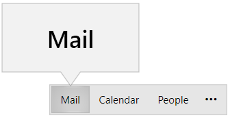
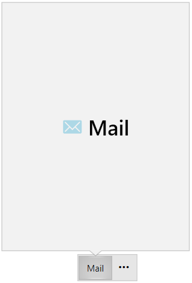
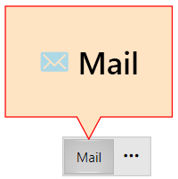
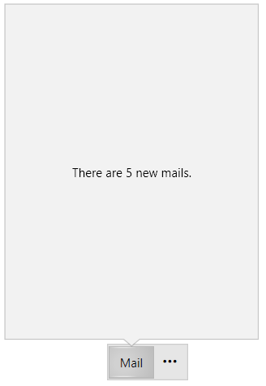

# Peek Popup

The `RadOfficeNavigationBar` control provides a popup preview window for its elements when the mouse is over one of them. This functionality is disabled by default. To enable it, set the `IsPeekPopupEnabled` property to __True__.

__Setting the IsPeekPopupEnabled property__
```XAML
    <telerik:RadOfficeNavigationBar x:Name="radOfficeNavigationBar" IsPeekPopupEnabled="True"/>
```

__Setting the IsPeekPopupEnabled property in code__
```C#
    this.radOfficeNavigationBar.IsPeekPopupEnabled = true;
```
```VB.NET
    Me.radOfficeNavigationBar.IsPeekPopupEnabled = True
```

__Displayed peek popup__



## Setting the Peek Popup Content

Each `RadOfficeNavigationBarItem` element allows you to customize the content that will be displayed. To do so, you can use its `PeekPopupContent`, `PeekPopupContentTemplate`, and `PeekPopupContentTemplateSelector` properties.

__Setting the peek popup content__
```XAML
    <telerik:RadOfficeNavigationBarItem Content="Mail" PeekPopupContent="Mail">
        <telerik:RadOfficeNavigationBarItem.PeekPopupContentTemplate>
            <DataTemplate>
                <StackPanel Orientation="Horizontal">
                    <telerik:RadGlyph Glyph="{StaticResource GlyphEmail}" Margin="0 0 7 0" FontSize="28" Foreground="LightBlue"/>
                    <TextBlock Text="{Binding}" FontWeight="SemiBold" FontSize="28"/>
                </StackPanel>
            </DataTemplate>
        </telerik:RadOfficeNavigationBarItem.PeekPopupContentTemplate>
    </telerik:RadOfficeNavigationBarItem>
```

__Peek popup with custom content__



## Customizing the Appearance of the Peek Popup

The peek popup's appearance can be customized for each RadOfficeNavigationBarItem element. To apply a custom style, you can utilize the `PeekPopupStyle` property. The custom Style has to target the `RadCallout` element as this element is used as the popup.

The following example is based on the RadOfficeNavigationBarItem's implementation from the above code snippet.

__Customizing the appearance of the peek popup__
```XAML
    <telerik:RadOfficeNavigationBarItem.PeekPopupStyle>
        <!--Set BasedOn property if NoXaml assemblies are used: BasedOn="{StaticResource RadCalloutStyle}"-->
        <Style TargetType="telerik:RadCallout">
            <Setter Property="Height" Value="100"/>
            <Setter Property="Width" Value="150"/>
            <Setter Property="Background" Value="Bisque"/>
            <Setter Property="BorderBrush" Value="Red"/>
            <Setter Property="BorderThickness" Value="3"/>
        </Style>
    </telerik:RadOfficeNavigationBarItem.PeekPopupStyle>
```

__Peek popup with custom style__



## Setting a String Format to the Peek Popup Content

The RadOfficeNavigationBarItem element allows you to apply a string format to the value that is set to the PeekPopupContent property. To set a string format, you can set the `PeekPopupContentStringFormat` property.

__Applying a string format to the peek popup content__
```XAML
    <telerik:RadOfficeNavigationBarItem Content="Mail" PeekPopupContent="5" PeekPopupContentStringFormat="There are {0} new e-mails."/>
```

__Peek popup content with applied string format__



## Controlling the Show/Close Popup Delay

You can control the show/close delay of the peek popup. To do so, you can set the `PeekPopupShowDelay` and `PeekPopupCloseDelay` properties of RadOfficeNavigationBar.

__Setting the PeekPopupShowDelay and PeekPopupCloseDelay properties__
```XAML
    <telerik:RadOfficeNavigationBar x:Name="radOfficeNavigationBar" PeekPopupShowDelay="0" PeekPopupCloseDelay="1000"/>
```

## PeekPopupOpening Event

The RadOfficeNavigationBar exposes the `PeekPopupOpening` event that will occur when peek popup is about to be opened. The event handler receives two arguments:

* The sender parameter contains the RadOfficeNavigationBar element. This argument is of type __object__, but can be cast to the RadOfficeNavigationBar type.

* The event arguments are of the type `PeekPopupOpeningEventArgs`. They expose the following properties:

    * `RadCallout`&mdash;This property contains the peek popup element, which is of the type RadCallout.

    * `CalloutPopupSettings`&mdash;The CalloutPopupSettings property contains information regarding the RadCallout element. This property is of the type CalloutPopupSettings.

    * `OfficeNavigationBarItem`&mdash;This property contains the RadOfficeNavigationBarItem that the peek popup belongs to.

    * `Cancel`&mdash;The Cancel property can be used to prevent the peek popup from opening. To stop the popup from opening, set this property to __false__.

__Prevent the peek popup from showing for a certain item__
```C#
    private void radOfficeNavigationBar_PeekPopupOpening(object sender, PeekPopupOpeningEventArgs e)
    {
        if (e.OfficeNavigationBarItem.Content.ToString() == "Mail")
        {
            e.Cancel = true;
        }
    }
```

__Prevent the peek popup from showing for a certain item__
```VB
    Private Sub radOfficeNavigationBar_PeekPopupOpening(ByVal sender As Object, ByVal e As  PeekPopupOpeningEventArgs)
        If e.OfficeNavigationBarItem.Content.ToString() Is "Mail" Then
            e.Cancel = True
        End If
    End Sub
```

## See Also
* [Custom Content]()
* [Navigation Options]()
* [Overflow Menu]()