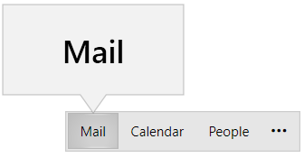
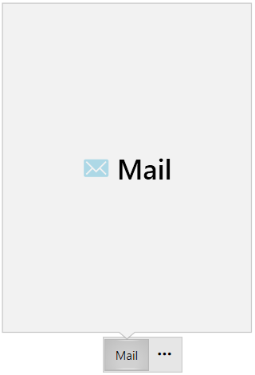
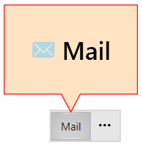
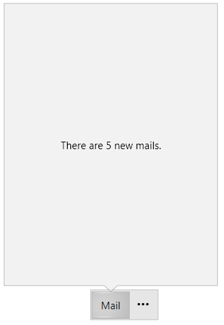

# Peek Popup

The `RadOfficeNavigationBar` control provides a popup preview window for its elements when the mouse is over one of them. This functionality is disabled by default. To enable it, set the `IsPeekPopupEnabled` property to __True__.

__Setting the IsPeekPopupEnabled property__
<snippet id='radofficenavigationbar-peek-popup-block_1-xaml' />

__Setting the IsPeekPopupEnabled property in code__
<snippet id='radofficenavigationbar-peek-popup-block_2-cs' />
<snippet id='radofficenavigationbar-peek-popup-block_2-vb' />

__Displayed peek popup__

## Setting the Peek Popup Content

Each `RadOfficeNavigationBarItem` element allows you to customize the content that will be displayed. To do so, you can use its `PeekPopupContent`, `PeekPopupContentTemplate`, and `PeekPopupContentTemplateSelector` properties.

__Setting the peek popup content__
<snippet id='radofficenavigationbar-peek-popup-block_3-xaml' />

__Peek popup with custom content__

## Customizing the Appearance of the Peek Popup

The peek popup's appearance can be customized for each RadOfficeNavigationBarItem element. To apply a custom style, you can utilize the `PeekPopupStyle` property. The custom Style has to target the `RadCallout` element as this element is used as the popup.

The following example is based on the RadOfficeNavigationBarItem's implementation from the above code snippet.

__Customizing the appearance of the peek popup__
<snippet id='radofficenavigationbar-peek-popup-block_4-xaml' />

__Peek popup with custom style__

## Setting a String Format to the Peek Popup Content

The RadOfficeNavigationBarItem element allows you to apply a string format to the value that is set to the PeekPopupContent property. To set a string format, you can set the `PeekPopupContentStringFormat` property.

__Applying a string format to the peek popup content__
<snippet id='radofficenavigationbar-peek-popup-block_5-xaml' />

__Peek popup content with applied string format__

## Controlling the Show/Close Popup Delay

You can control the show/close delay of the peek popup. To do so, you can set the `PeekPopupShowDelay` and `PeekPopupCloseDelay` properties of RadOfficeNavigationBar.

__Setting the PeekPopupShowDelay and PeekPopupCloseDelay properties__
<snippet id='radofficenavigationbar-peek-popup-block_6-xaml' />

## PeekPopupOpening Event

The RadOfficeNavigationBar exposes the `PeekPopupOpening` event that will occur when peek popup is about to be opened. The event handler receives two arguments:

* The sender parameter contains the RadOfficeNavigationBar element. This argument is of type __object__, but can be cast to the RadOfficeNavigationBar type.

* The event arguments are of the type `PeekPopupOpeningEventArgs`. They expose the following properties:

    * `RadCallout`&mdash;This property contains the peek popup element, which is of the type RadCallout.

    * `CalloutPopupSettings`&mdash;The CalloutPopupSettings property contains information regarding the RadCallout element. This property is of the type CalloutPopupSettings.

    * `OfficeNavigationBarItem`&mdash;This property contains the RadOfficeNavigationBarItem that the peek popup belongs to.

    * `Cancel`&mdash;The Cancel property can be used to prevent the peek popup from opening. To stop the popup from opening, set this property to __false__.

__Prevent the peek popup from showing for a certain item__
<snippet id='radofficenavigationbar-peek-popup-block_7-cs' />

__Prevent the peek popup from showing for a certain item__
<snippet id='radofficenavigationbar-peek-popup-block_8-vb' />

## See Also
* [Custom Content]()
* [Navigation Options]()
* [Overflow Menu]()