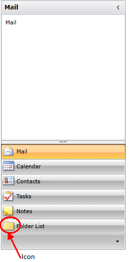
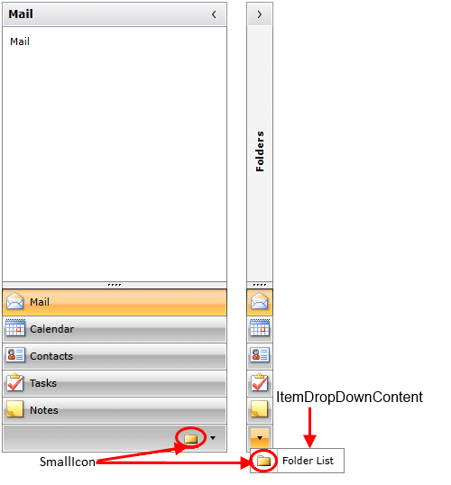
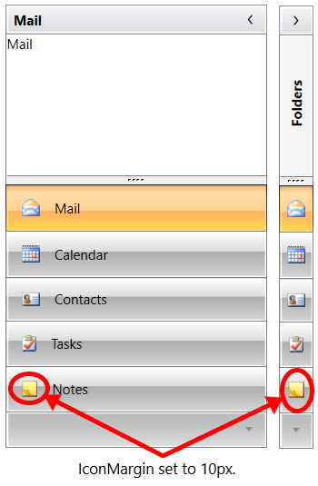

# Icons

The __RadOutlookBarItems__ expose the __Icon__ and __SmallIcon__ properties. They are of type __BitmapSource__ and they define the source of the picture placed infront of the content of the __RadOutlookBarItem__. The bar items expose an additional __IconMargin__ property. It is used to get or set the margin of the __Icon__ element inside of the item. 

The __Icon__ property gets or sets the icon of the __RadOutlookBarItem__ when it is in normal state – not minimized.

__Example 1: Setting Icon Property__
```XAML
	<telerik:RadOutlookBarItem Header="Folder List" Icon="foldersSmall.png" />
```

#### __Figure 1 : Icon Property Result__


The __SmallIcon__ property gets or sets the icon of the __RadOutlookBarItem__ when it is in the  [minimized area]() or when it is in the __ItemDropDownContent__. The __ItemDropDownContent__ is the content of the pop up which is opened after you click the [overflow button]() located in the lower right corner of the __RadOutlookBar__.

#### __Figure 2 : Setting SmallIcon property__


__Example 2: Setting IconMargin Property__
```XAML	
    <telerik:RadOutlookBarItem  Header="Folder List" Icon="foldersSmall.png" IconMargin="10">               
``` 

#### __Figure 3: IconMargin Property Result__


>tip You can see how to bind the icon properties to e property of a business object in the [Data Binding example in the online SDK repository](https://github.com/telerik/xaml-sdk/tree/master/OutlookBar/DataBinding).

## See Also
 * [Visual Structure]()
 * [Templates]()
 * [Data Binding]()
